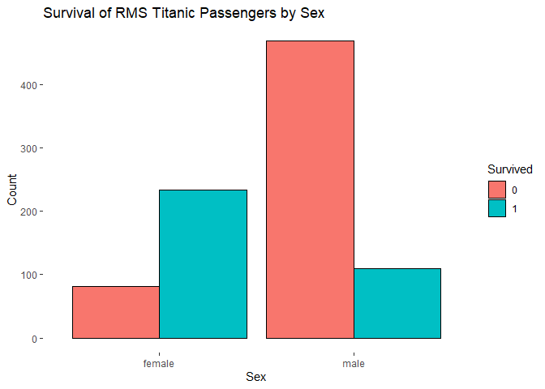

Analysis with Regular Expressions (ReGex)
================

# Analysis with Regular Expressions (ReGex)

Welcome to my notebook once again. I am [Elijah
Rona](https://twitter.com/Elijah_Rona) currently building my [portfolio
in data science and
analytics](https://github.com/elijahrona/Elijah-Rona-ML-Journey) as I
hope to get every better at it.

For a very long time now, I have come across but avoided Regular
Expressions (ReGex) because while the application seems very cool, ReGex
looked difficult when I first saw it.

Well, there’s no way I can avoid ReGex, so I had to study it. However, I
am realizing that I love ReGex and it is more like my most favorite part
of analysis now as I can now analyze the inner parts of any dataset with
strings.

Let’s get to it as I hope to share my knowledge of ReGex with you
through this notebook… \## Loading the Libraries

``` r
library(tidyverse) #for stringr, dplyr, and other essential libraries
```

    ## -- Attaching packages --------------------------------------- tidyverse 1.3.1 --

    ## v ggplot2 3.3.5     v purrr   0.3.4
    ## v tibble  3.1.2     v dplyr   1.0.7
    ## v tidyr   1.1.3     v stringr 1.4.0
    ## v readr   1.4.0     v forcats 0.5.1

    ## -- Conflicts ------------------------------------------ tidyverse_conflicts() --
    ## x dplyr::filter() masks stats::filter()
    ## x dplyr::lag()    masks stats::lag()

``` r
library(treemapify) #to create a tree map with ggplot2
```

    ## Warning: package 'treemapify' was built under R version 4.1.3

``` r
library(patchwork) #to combine plots
```

    ## Warning: package 'patchwork' was built under R version 4.1.3

## Loading the Dataset (Titanic)

For this notebook, I will use ReGex to collect important details from
the Titanic dataset for further analysis

``` r
titanic <- read.csv("C:/Users/Octopus/Downloads/train.csv")
head(titanic)
```

    ##   PassengerId Survived Pclass
    ## 1           1        0      3
    ## 2           2        1      1
    ## 3           3        1      3
    ## 4           4        1      1
    ## 5           5        0      3
    ## 6           6        0      3
    ##                                                  Name    Sex Age SibSp Parch
    ## 1                             Braund, Mr. Owen Harris   male  22     1     0
    ## 2 Cumings, Mrs. John Bradley (Florence Briggs Thayer) female  38     1     0
    ## 3                              Heikkinen, Miss. Laina female  26     0     0
    ## 4        Futrelle, Mrs. Jacques Heath (Lily May Peel) female  35     1     0
    ## 5                            Allen, Mr. William Henry   male  35     0     0
    ## 6                                    Moran, Mr. James   male  NA     0     0
    ##             Ticket    Fare Cabin Embarked
    ## 1        A/5 21171  7.2500              S
    ## 2         PC 17599 71.2833   C85        C
    ## 3 STON/O2. 3101282  7.9250              S
    ## 4           113803 53.1000  C123        S
    ## 5           373450  8.0500              S
    ## 6           330877  8.4583              Q

## Regular Expressions

Let’s use ReGex to collect the titles of people in the “Name” column of
the dataset

### 1. Get the Title of People in the Name Column

``` r
f1 <- "(?<=,\\s)[\\w]+(?=.)"

title <- str_extract(titanic$Name, f1)
head(title,20)
```

    ##  [1] "Mr"     "Mrs"    "Miss"   "Mrs"    "Mr"     "Mr"     "Mr"     "Master"
    ##  [9] "Mrs"    "Mrs"    "Miss"   "Miss"   "Mr"     "Mr"     "Miss"   "Mrs"   
    ## [17] "Master" "Mr"     "Mrs"    "Mrs"

The symbols in the formula above (?\<=,\\s)\[\\w\]+(?=.) are:

**(?\<=,\\s)**: This means that is a comma (,) and a space (” “) before
our string of interest.

**\[\\w\]+**: This simply means that our string of interest is a word
with at least one letter.

**(?=.)**: This signifies that there is a full stop (.) after our string
of interest

Now it is time to assign our collect string to a new column in the
dataset.

``` r
titanic$Title <- title
```

### 2. Get the Cabin Letter in the Cabin Column

``` r
f2 <- "^\\w"

cabin <- str_extract(titanic$Cabin, f2)

cabin %>%
na.omit() %>%
head(20)
```

    ##  [1] "C" "C" "E" "G" "C" "D" "A" "C" "B" "D" "B" "C" "B" "C" "F" "F" "C" "E" "A"
    ## [20] "D"

The formula **^\\w** is instructing R that we are interested in only the
first letter () at the beginning (^) of the string.

It is time to replace the previous values in the column with our
collected value.

``` r
titanic$Cabin <- cabin
```

### 3. Get the Surname of Passengers from the Name Column

``` r
f3 <- "^\\w*(.|\\s)?(\\w*(.|\\s)?(\\w*)?)?(?=,)"

surname <- str_extract(titanic$Name, f3)
head(surname,20)
```

    ##  [1] "Braund"        "Cumings"       "Heikkinen"     "Futrelle"     
    ##  [5] "Allen"         "Moran"         "McCarthy"      "Palsson"      
    ##  [9] "Johnson"       "Nasser"        "Sandstrom"     "Bonnell"      
    ## [13] "Saundercock"   "Andersson"     "Vestrom"       "Hewlett"      
    ## [17] "Rice"          "Williams"      "Vander Planke" "Masselmani"

This ReGex is a bit complex as some people have spaces, hiphens, and
other spaces in their surnames. Well, here’s the explanation:

**^\\w**\*: we are looking for a string with letters (at least one
letter)

**(.\|\\s)?**: part of our string of interest may or may not have a full
stop (.) or a space (” “)

**(\\w*(.\|\\s)?(\\w*)?)?**: the string may or may not have another name
(i.e. double firstname), space, and yet another name (rare occassions of
a triple firstname).

**(?=,)**: the name is proceeded by a comma (,)

Here is an easier way to get the same result:

``` r
f4 <- ".*(=?,)"

surname2 <- str_extract(titanic$Name, f4)
head(surname2,20)
```

    ##  [1] "Braund,"        "Cumings,"       "Heikkinen,"     "Futrelle,"     
    ##  [5] "Allen,"         "Moran,"         "McCarthy,"      "Palsson,"      
    ##  [9] "Johnson,"       "Nasser,"        "Sandstrom,"     "Bonnell,"      
    ## [13] "Saundercock,"   "Andersson,"     "Vestrom,"       "Hewlett,"      
    ## [17] "Rice,"          "Williams,"      "Vander Planke," "Masselmani,"

The simple explanation is that we just want to collect every letter
symbol, or space that preceeds the comma (,). This simply ReGex is
applicable to this dataset because the name column is well-written.
However we may not be so lucky for other datasets.

It is time to assign this ReGex to a new column in our dataset

``` r
titanic$Surname <- surname
```

## Wrangling (Fixing the Column Types)

Some columns in this dataset do not come with the correct type, so let’s
fix them:

``` r
titanic <- titanic %>%
  mutate(across(c(Survived, Pclass, Sex, Parch, Cabin, Embarked, Surname, Title), as.factor))
```

## Grouping and Visualization

It is time to visualize our dataset. However, we will first create some
grouped dataframes to help us explain the dataset better.

### 1. By Surname

Let’s start by grouping the dataset based on the “Surname” column

``` r
grouped_surname <- titanic %>%
  group_by(Surname, Embarked) %>%
  summarize(Members = length(Surname), Average_Fare = mean(Fare), Survival_Rate = round(100*mean(as.numeric(Survived == "1")),digits = 2))
```

    ## `summarise()` has grouped output by 'Surname'. You can override using the `.groups` argument.

``` r
head(grouped_surname)
```

    ## # A tibble: 6 x 5
    ## # Groups:   Surname [6]
    ##   Surname Embarked Members Average_Fare Survival_Rate
    ##   <fct>   <fct>      <int>        <dbl>         <dbl>
    ## 1 Abbing  S              1         7.55             0
    ## 2 Abbott  S              2        20.2             50
    ## 3 Abelson C              2        24               50
    ## 4 Adahl   S              1         7.25             0
    ## 5 Adams   S              1         8.05             0
    ## 6 Ahlin   S              1         9.48             0

``` r
dim(grouped_surname)
```

    ## [1] 679   5

We added the port of embarking column (Embarked) to help us to identify
and distinguish multiple families of the same surname (if any). The best
column to do this would have been the “Cabin” column, but it has too
many missing variables, so we have to use something else.

While we can make a chart with this dataset, it appears to have too many
surnames. However, you can clearly see the rate of survival for each
family. Let us filter the families so that we will only have families
with at least 4 members.

``` r
grouped_surname_filtered <- grouped_surname %>%
  filter(Members > 3)

head(grouped_surname_filtered)
```

    ## # A tibble: 6 x 5
    ## # Groups:   Surname [6]
    ##   Surname   Embarked Members Average_Fare Survival_Rate
    ##   <fct>     <fct>      <int>        <dbl>         <dbl>
    ## 1 Andersson S              9         26.1          22.2
    ## 2 Asplund   S              4         31.4          75  
    ## 3 Baclini   C              4         19.3         100  
    ## 4 Carter    S              6         88.7          66.7
    ## 5 Ford      S              4         34.4           0  
    ## 6 Fortune   S              4        263            50

``` r
dim(grouped_surname_filtered)
```

    ## [1] 16  5

Now that we have a smaller dataframe with only 16 unique surnames, let
us create a tree map so that we can see the sizes of each family as well
as their rate of survival.

``` r
g1 <- ggplot(grouped_surname_filtered, aes(area = Members, fill = Survival_Rate,
                                           label = paste(Surname, Members, sep = "\n"))) +
  geom_treemap() +
  scale_fill_gradient(low = "coral1", high = "darkturquoise") +
  geom_treemap_text(colour = "black",
                    place = "centre",
                    size = 15) +
  ggtitle("Survival Rate of Common Families in the RMS Titanic")
g1
```

<!-- -->

Now, let us analyze the “Title” column so that we can tell the most
common titles of people in the RMS titanic ship. We will not focus on
the rate of survival by title.

### 2. By Title

``` r
grouped_title <- titanic %>%
  group_by(Title, Sex) %>%
  summarize(Count = length(Title))
```

    ## `summarise()` has grouped output by 'Title'. You can override using the `.groups` argument.

``` r
head(grouped_title)
```

    ## # A tibble: 6 x 3
    ## # Groups:   Title [5]
    ##   Title    Sex    Count
    ##   <fct>    <fct>  <int>
    ## 1 Capt     male       1
    ## 2 Col      male       2
    ## 3 Don      male       1
    ## 4 Dr       female     1
    ## 5 Dr       male       6
    ## 6 Jonkheer male       1

``` r
g2 <- ggplot(grouped_title, aes(area = Count, fill = Title, subgroup = Sex,
                                label = paste(Title, Count, sep = "\n"))) +
  geom_treemap() +
  geom_treemap_subgroup_border(colour = "black", size = 5) +
  geom_treemap_subgroup_text(place = "centre", grow = TRUE,
                             alpha = 0.25, colour = "white",
                             fontface = "italic") +
  geom_treemap_text(colour = "black",
                    place = "centre",
                    size = 15) +
  ggtitle("RMS Titanic Passengers Grouped by Their Sex and Title")
g2
```

<!-- -->

As you can see, we have way more males than females. Also, the most
common title in the ship is “Mr,” followeed by “Miss” and “Mrs.”

Let us create a simple bar chart for a few other columns.

``` r
titanic_viz <- function(x) {
  titanic %>%
    group_by(.data[[x]], Survived) %>%
    summarize(Count = length(Survived))%>%
    na.omit() %>%
    ggplot(aes(fill= Survived, y=Count, x=.data[[x]])) + 
    geom_bar(position="dodge", stat="identity", colour="black") +
    theme(
      panel.background = element_rect(fill = "white",
                                      colour = "white",
                                      size = 0.5, linetype = "solid"))
}
```

### 3. By Sex

``` r
g3 <- titanic_viz("Sex") +
  ggtitle("Survival of RMS Titanic Passengers by Sex")
```

    ## `summarise()` has grouped output by 'Sex'. You can override using the `.groups` argument.

``` r
g3
```

<!-- -->

### 4. By Cabin

``` r
g4 <- titanic_viz("Cabin") +
  ggtitle("Survival of RMS Titanic Passengers by Cabin")
```

    ## `summarise()` has grouped output by 'Cabin'. You can override using the `.groups` argument.

``` r
g4
```

<!-- -->

### 5. By Port Embarked

``` r
g5 <- titanic_viz("Embarked") +
  ggtitle("Survival of RMS Titanic Passengers by Port Embarked")
```

    ## `summarise()` has grouped output by 'Embarked'. You can override using the `.groups` argument.

``` r
g5
```

<!-- -->

## Dashboard or Combined Plots

Now that we have created different charts, let us make a simple
dashboard with them.

``` r
library(repr)
options(repr.plot.width=16, repr.plot.height = 8)
g2 + plot_annotation(caption = "By: @Elijah_Rona")
```

<!-- -->

``` r
g1/(g3|g4|g5) + plot_annotation(
  title = "RMS Titanic Survical Dashboard",
  caption = "By: @Elijah_Rona")
```

<!-- -->

## Conclusion

ReGex helps us to analyze features of a dataset that we would have
ignored. It is helpful, so everyone must learn it. I will continue to
learn and apply other useful concepts as I hope to improve.

If you’d love to join me in my progress, do check out my [GitHub
repo](https://github.com/elijahrona/Elijah-Rona-ML-Journey) (work in
progress), connect with, or contact me via
[Twitter](https://twitter.com/Elijah_Rona) or
[LinkedIn](https://www.linkedin.com/in/elijah-rona-389646124/).
