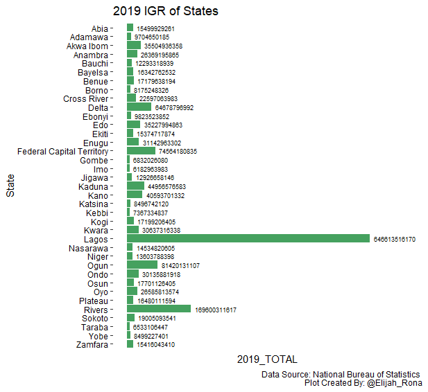
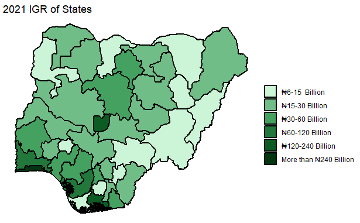
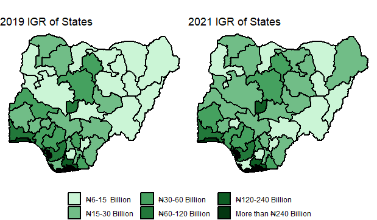
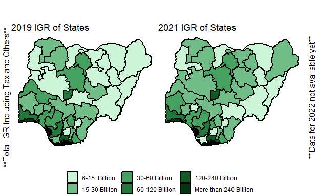
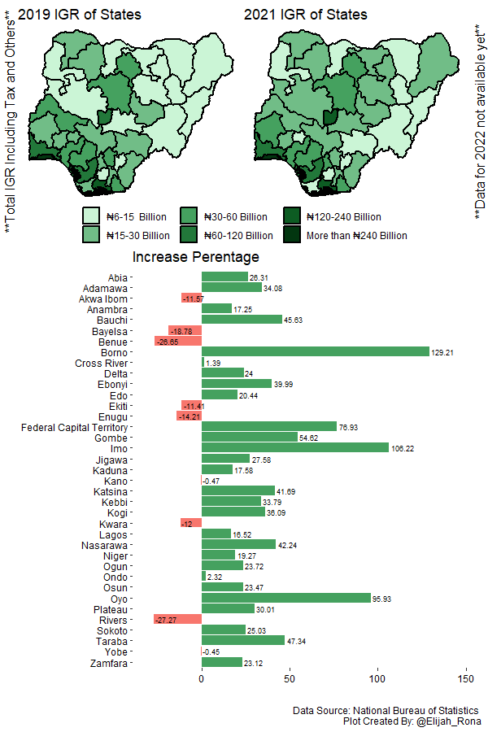

Comparison of Nigerian States’ IGR Growth
================

# Comparison of Nigerian States’ IGR Growth

I am using R to create a simple dashboard with the aim of comparing
states in Nigeria based on their IGR performance.

## Methodology

I collected the data from the [National Bureau of
Statistics](https://www.nigerianstat.gov.ng/) (NBS) website and analyzed
it using R.

## Loading the Libraries

``` r
library(tidyverse)
```

    ## Warning: package 'tidyverse' was built under R version 4.1.3

    ## -- Attaching packages --------------------------------------- tidyverse 1.3.2 --
    ## v ggplot2 3.4.0      v purrr   0.3.5 
    ## v tibble  3.1.8      v dplyr   1.0.10
    ## v tidyr   1.2.1      v stringr 1.4.1 
    ## v readr   2.1.3      v forcats 0.5.2

    ## Warning: package 'tibble' was built under R version 4.1.3

    ## Warning: package 'tidyr' was built under R version 4.1.3

    ## Warning: package 'readr' was built under R version 4.1.3

    ## Warning: package 'purrr' was built under R version 4.1.3

    ## Warning: package 'dplyr' was built under R version 4.1.3

    ## Warning: package 'stringr' was built under R version 4.1.3

    ## Warning: package 'forcats' was built under R version 4.1.3

    ## -- Conflicts ------------------------------------------ tidyverse_conflicts() --
    ## x dplyr::filter() masks stats::filter()
    ## x dplyr::lag()    masks stats::lag()

``` r
library(geodata)
```

    ## Warning: package 'geodata' was built under R version 4.1.3

    ## Loading required package: terra

    ## Warning: package 'terra' was built under R version 4.1.3

    ## terra 1.6.17
    ## 
    ## Attaching package: 'terra'
    ## 
    ## The following object is masked from 'package:tidyr':
    ## 
    ##     extract

``` r
library(RColorBrewer)
```

    ## Warning: package 'RColorBrewer' was built under R version 4.1.3

``` r
library(patchwork)
```

    ## Warning: package 'patchwork' was built under R version 4.1.3

    ## 
    ## Attaching package: 'patchwork'
    ## 
    ## The following object is masked from 'package:terra':
    ## 
    ##     area

``` r
library(ggpubr)
```

    ## Warning: package 'ggpubr' was built under R version 4.1.3

    ## 
    ## Attaching package: 'ggpubr'
    ## 
    ## The following object is masked from 'package:terra':
    ## 
    ##     rotate

``` r
library(readxl)
```

    ## Warning: package 'readxl' was built under R version 4.1.3

``` r
library(sf)
```

    ## Warning: package 'sf' was built under R version 4.1.3

    ## Linking to GEOS 3.10.2, GDAL 3.4.1, PROJ 7.2.1; sf_use_s2() is TRUE

``` r
library(readxl)
```

## Loading the Dataset

``` r
aa <- read_excel("C:/Users/Octopus/Downloads/2019-2021 IGR  OF STATES.xlsx")
```

``` r
head(aa)
```

    ## # A tibble: 6 x 10
    ##   State  2019_~1 2019_~2 2019_~3 2020_~4 2020_~5 2020_~6 2021_~7 2021_~8 2021_~9
    ##   <chr>    <dbl> <chr>     <dbl>   <dbl> <chr>     <dbl>   <dbl> <chr>     <dbl>
    ## 1 Abia   8.97e 9 653201~ 1.55e10 8.12e 9 780618~ 1.59e10 6.51e 9 130681~ 1.96e10
    ## 2 Adama~ 7.15e 9 255519~ 9.70e 9 6.69e 9 163998~ 8.33e 9 9.16e 9 385506~ 1.30e10
    ## 3 Akwa ~ 3.09e10 460631~ 3.55e10 2.66e10 408828~ 3.07e10 2.72e10 418384~ 3.14e10
    ## 4 Anamb~ 1.61e10 102363~ 2.64e10 1.58e10 121606~ 2.80e10 1.83e10 126423~ 3.09e10
    ## 5 Bauchi 9.72e 9 257397~ 1.23e10 1.21e10 961180~ 1.30e10 1.58e10 206387~ 1.79e10
    ## 6 Bayel~ 1.61e10 246787~ 1.63e10 1.20e10 173136~ 1.22e10 1.25e10 755032~ 1.33e10
    ## # ... with abbreviated variable names 1: `2019_TAXREVENUE`, 2: `2019_OTHERS`,
    ## #   3: `2019_TOTAL`, 4: `2020_TAXREVENUE`, 5: `2020_OTHERS`, 6: `2020_TOTAL`,
    ## #   7: `2021_TAXREVENUE`, 8: `2021_OTHERS`, 9: `2021_TOTAL`

## Making a Few Changes

I want to remove the row with “Total,” as I do not need it. Also, I want
to create extra columns in the dataset that will help with the colors
and other features of the charts.

``` r
#Create a column with the percentage difference between 2021 and 2019 for each state
aa["Percent_Change"] <- round((((aa["2021_TOTAL"]-aa["2019_TOTAL"])/aa["2019_TOTAL"])*100),2)

#Delete the row with "Total"
aa <- aa[-38,]

#Change "FCT" to its full name
aa[37,1] <- "Federal Capital Territory"

#Create two columns with colors
aa <- aa %>%
  mutate(cond = case_when(
    Percent_Change > 0 ~ '#45a15f',
    Percent_Change < 0 ~ '#F8766D',
    TRUE ~ '#F8766D'))

aa <- aa %>%
  mutate(cond1 = case_when(
    Percent_Change > 0 ~ -0.1,
    Percent_Change < 0 ~ -0.1,
  ))
```

## Visualization

### 2019

``` r
ggplot(data = aa, aes(x = State, y =`2019_TOTAL`)) +
  geom_bar(stat = "identity", aes(fill = "#45a15f")) +
  scale_fill_identity() +
  geom_text(aes(label = round(`2019_TOTAL`,0), hjust = cond1), size = 2.5) +
  coord_flip() + 
  theme(panel.background = element_rect(fill = "white",
                                        colour = "white",
                                        linewidth = 0.5, linetype = "solid"),
        axis.text = element_text(color="black"),
        axis.text.x=element_blank(),
        axis.ticks.x=element_blank()) +
  scale_x_discrete(limits = rev(levels(as.factor(aa$State)))) +
  ylim(0,750000000000)+
  labs(title = "2019 IGR of States",
       caption = "Data Source: National Bureau of Statistics \n Plot Created By: @Elijah_Rona")
```

<!-- -->

### 2021

``` r
ggplot(data = aa, aes(x = State, y =`2021_TOTAL`)) +
  geom_bar(stat = "identity", aes(fill = "#45a15f")) +
  scale_fill_identity() +
  geom_text(aes(label = round(`2021_TOTAL`,0), hjust = cond1), size = 2.5) +
  coord_flip() + 
  theme(panel.background = element_rect(fill = "white",
                                        colour = "white",
                                        linewidth = 0.5, linetype = "solid"),
        axis.text = element_text(color="black"),
        axis.text.x=element_blank(),
        axis.ticks.x=element_blank()) +
  scale_x_discrete(limits = rev(levels(as.factor(aa$State)))) +
  ylim(0,900000000000)+
  labs(title = "2021 IGR of States",
       caption = "Data Source: National Bureau of Statistics \n Plot Created By: @Elijah_Rona")
```

<!-- -->

### Compare 2019 and 2021

``` r
p1 <- ggplot(data = aa, aes(x = State, y =Percent_Change)) +
  geom_bar(stat = "identity", aes(fill = cond)) +
  scale_fill_identity() +
  geom_text(aes(label = Percent_Change, hjust = cond1), size = 2.5) +
  coord_flip() + 
  theme(panel.background = element_rect(fill = "white",
                                        colour = "white",
                                        linewidth = 0.5, linetype = "solid"),
        axis.text = element_text(color="black")) +
  scale_x_discrete(limits = rev(levels(as.factor(aa$State)))) +
  labs(title = "Increase Perentage",
       caption = "Data Source: National Bureau of Statistics \n Plot Created By: @Elijah_Rona")+
  xlab("") + 
  ylab("") +
  ylim(-30,150)
p1
```

<!-- -->

### Choropleth Maps

``` r
states <- geodata::gadm("Nigeria",
                        level = 1,
                        path = tempdir()) %>% 
sf::st_as_sf()
head(states)
```

    ## Simple feature collection with 6 features and 11 fields
    ## Geometry type: GEOMETRY
    ## Dimension:     XY
    ## Bounding box:  xmin: 5.376527 ymin: 4.270418 xmax: 13.72793 ymax: 12.5025
    ## Geodetic CRS:  WGS 84
    ##     GID_1 GID_0 COUNTRY    NAME_1 VARNAME_1 NL_NAME_1 TYPE_1 ENGTYPE_1 CC_1
    ## 1 NGA.1_1   NGA Nigeria      Abia      <NA>      <NA>  State     State <NA>
    ## 2 NGA.2_1   NGA Nigeria   Adamawa      <NA>      <NA>  State     State <NA>
    ## 3 NGA.3_1   NGA Nigeria Akwa Ibom      <NA>      <NA>  State     State <NA>
    ## 4 NGA.4_1   NGA Nigeria   Anambra      <NA>      <NA>  State     State <NA>
    ## 5 NGA.5_1   NGA Nigeria    Bauchi      <NA>      <NA>  State     State <NA>
    ## 6 NGA.6_1   NGA Nigeria   Bayelsa      <NA>      <NA>  State     State <NA>
    ##   HASC_1 ISO_1                       geometry
    ## 1  NG.AB NG-AB POLYGON ((7.462832 4.98177,...
    ## 2  NG.AD NG-AD POLYGON ((12.25072 8.172622...
    ## 3  NG.AK NG-AK MULTIPOLYGON (((8.319584 4....
    ## 4  NG.AN NG-AN POLYGON ((6.935766 5.857954...
    ## 5  NG.BA NG-BA POLYGON ((9.752657 9.600874...
    ## 6  NG.BY NG-BY MULTIPOLYGON (((6.096529 4....

``` r
states <- states %>% 
  rename(State = NAME_1)

df = merge(x=states,y=aa,by="State", all = FALSE)
```

``` r
df <- df %>%
  mutate(cond2 = case_when(
    `2019_TOTAL` < 15000000000 ~ "₦6-15  Billion",
    `2019_TOTAL` < 30000000000 ~ "₦15-30 Billion",
    `2019_TOTAL` < 60000000000 ~ "₦30-60 Billion",
    `2019_TOTAL` < 120000000000 ~ "₦60-120 Billion",
    `2019_TOTAL` < 240000000000 ~ "₦120-240 Billion",
    `2019_TOTAL` > 240000000000 ~ "More than ₦240 Billion"))

df$cond2 <- factor(df$cond2, levels = c('₦6-15  Billion',
                                        '₦15-30 Billion',
                                        '₦30-60 Billion',
                                        '₦60-120 Billion',
                                        '₦120-240 Billion',
                                        'More than ₦240 Billion'))

df <- df %>%
  mutate(cond3 = case_when(
    `2021_TOTAL` < 15000000000 ~ "₦6-15  Billion",
    `2021_TOTAL` < 30000000000 ~ "₦15-30 Billion",
    `2021_TOTAL` < 60000000000 ~ "₦30-60 Billion",
    `2021_TOTAL` < 120000000000 ~ "₦60-120 Billion",
    `2021_TOTAL` < 240000000000 ~ "₦120-240 Billion",
    `2021_TOTAL` > 240000000000 ~ "More than ₦240 Billion"))

df$cond3 <- factor(df$cond3, levels = c('₦6-15  Billion',
                                        '₦15-30 Billion',
                                        '₦30-60 Billion',
                                        '₦60-120 Billion',
                                        '₦120-240 Billion',
                                        'More than ₦240 Billion'))

head(df)
```

    ## Simple feature collection with 6 features and 25 fields
    ## Geometry type: GEOMETRY
    ## Dimension:     XY
    ## Bounding box:  xmin: 5.376527 ymin: 4.270418 xmax: 13.72793 ymax: 12.5025
    ## Geodetic CRS:  WGS 84
    ##       State   GID_1 GID_0 COUNTRY VARNAME_1 NL_NAME_1 TYPE_1 ENGTYPE_1 CC_1
    ## 1      Abia NGA.1_1   NGA Nigeria      <NA>      <NA>  State     State <NA>
    ## 2   Adamawa NGA.2_1   NGA Nigeria      <NA>      <NA>  State     State <NA>
    ## 3 Akwa Ibom NGA.3_1   NGA Nigeria      <NA>      <NA>  State     State <NA>
    ## 4   Anambra NGA.4_1   NGA Nigeria      <NA>      <NA>  State     State <NA>
    ## 5    Bauchi NGA.5_1   NGA Nigeria      <NA>      <NA>  State     State <NA>
    ## 6   Bayelsa NGA.6_1   NGA Nigeria      <NA>      <NA>  State     State <NA>
    ##   HASC_1 ISO_1 2019_TAXREVENUE        2019_OTHERS  2019_TOTAL 2020_TAXREVENUE
    ## 1  NG.AB NG-AB      8967911372      6532017888.96 15499929261      8115046043
    ## 2  NG.AD NG-AD      7149450997 2555199188.0700002  9704650185      6689884415
    ## 3  NG.AK NG-AK     30898622006         4606314352 35504936358     26608481531
    ## 4  NG.AN NG-AN     16132798621 10236397243.809999 26369195865     15849268432
    ## 5  NG.BA NG-BA      9719343046      2573975892.52 12293318939     12078114538
    ## 6  NG.BY NG-BY     16095974641          246787891 16342762532     12007639112
    ##          2020_OTHERS  2020_TOTAL 2021_TAXREVENUE        2021_OTHERS  2021_TOTAL
    ## 1 7806180136.5200005 15921226180      6510207510 13068124081.059999 19578331591
    ## 2      1639986291.22  8329870707      9156545181 3855066046.8000002 13011611228
    ## 3 4088288747.0100002 30696770278     27212666835 4183845259.3800001 31396512095
    ## 4      12160638148.6 28009906580     18274310246 12642364366.190001 30916674612
    ## 5 961180274.32000005 13039294812     15838568155 2063879812.9300001 17902447968
    ## 6          173136031 12180775143     12518959695          755032609 13273992304
    ##   Percent_Change    cond cond1                       geometry
    ## 1          26.31 #45a15f  -0.1 POLYGON ((7.462832 4.98177,...
    ## 2          34.08 #45a15f  -0.1 POLYGON ((12.25072 8.172622...
    ## 3         -11.57 #F8766D  -0.1 MULTIPOLYGON (((8.319584 4....
    ## 4          17.25 #45a15f  -0.1 POLYGON ((6.935766 5.857954...
    ## 5          45.63 #45a15f  -0.1 POLYGON ((9.752657 9.600874...
    ## 6         -18.78 #F8766D  -0.1 MULTIPOLYGON (((6.096529 4....
    ##                   cond2                 cond3
    ## 1 <U+20A6>15-30 Billion <U+20A6>15-30 Billion
    ## 2 <U+20A6>6-15  Billion <U+20A6>6-15  Billion
    ## 3 <U+20A6>30-60 Billion <U+20A6>30-60 Billion
    ## 4 <U+20A6>15-30 Billion <U+20A6>30-60 Billion
    ## 5 <U+20A6>6-15  Billion <U+20A6>15-30 Billion
    ## 6 <U+20A6>15-30 Billion <U+20A6>6-15  Billion

``` r
p2 <- ggplot(df) +
  geom_sf(aes(fill = cond2),
          color = "black",
          linetype = 1,
          linewidth = 0.8)+
  labs(title = "2019 IGR of States") +
  theme_void() +
  scale_fill_manual(values=c("#cbf5d6", "#71bd87",
                                      "#45a15f", "#22783a",
                                      "#0d5c23", "#023610"),
                                      name="")
p2
```

<!-- -->

``` r
p3 <- ggplot(df) +
  geom_sf(aes(fill = cond3),
          color = "black",
          linetype = 1,
          linewidth = 0.8)+
  labs(title = "2021 IGR of States") +
  theme_void() +
  scale_fill_manual(values=c("#cbf5d6", "#71bd87",
                                      "#45a15f", "#22783a",
                                      "#0d5c23", "#023610"),
                                      name="")
p3
```

<!-- -->

``` r
p4 <- ggarrange(p2, p3, ncol=2, common.legend = TRUE, legend="bottom")
p4
```

<!-- -->

### Combining Charts to Make a Dashboard

``` r
p5 <- annotate_figure(p4,
                left = text_grob("**Total IGR Including Tax and Others**", color = "black", rot = 90),
                right = text_grob("**Data for 2022 not available yet**", color = "black", rot = 90))
p5
```

<!-- -->

``` r
ggarrange(p5, p1, nrow=2, heights = c(1, 2))
```

<!-- -->

## Conclusion

Using data to monitor the performance of states is better than using the
words (i.e., ordinary opinions) of people. There are so many insights
that we can draw from the available data, but what is certain is that
some states people praise truly need to work harder to increase their
IGR performance.

Check out my activities on [Twitter](https://twitter.com/elijah_rona)
and [LinkedIn](https://www.linkedin.com/in/elijah-rona/).
