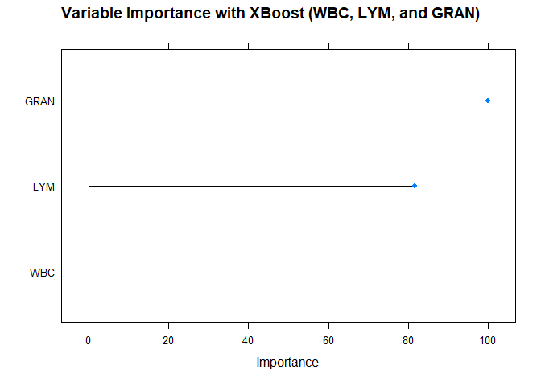

Do You Have Malaria or Covid-19?
================

# **Do You Have Malaria or Covid-19?**

Various models to predict if someone has covid-19, malaria, or is
negative

# About the Problem and DataSet

Many Covid-19 positive persons (in Nigeria) say that they have syptoms
of Malaria, so they treat malaria instead of the actual covid-19. Well,
the truth is that they do not trust the test results (nor believe that
there is covid-19 in Nigeria).

Asides from the visible symptoms of malaria and covid-19, medical lab
scientists observed that malaria and covid-19 have different effects on
the lymphocyte count(LYM), Granulocyte count (GRAN), the Total White
Blood Cell count (WBC), and the Hemoglobin count (HGB).

For their final year research projects, my classmates collected
information on the LYM, GRAN, WBC, and HGB levels of malaria and
covid-19 patients as well as that of negative people.

They were able to get the details of 100 covid19 patients, 68 malaria
patients, and 40 negative people from several labs. With their
permission, I combined all their data to form one dataset to train
models into deciding the status of someoe (covid-19, malaria, or
negative) based on their lymphocyte count(LYM), Granulocyte count
(GRAN), the Total White Blood Cell count (WBC), and the Hemoglobin count
(HGB).

# About Me

I am Elijah Rona, I started learning data analytics (then fell in love
with machine learning) early this year. I am very much in love with this
profession as a student of Biology and an aspirant Mathematical
Biologist. I hope to get involved in data anaytics and machine learning
projects related to health, agriculture, environment (climate and the
rest), and other applied science fields in the nearest future.

# Loading Libraries

``` r
library(tidyverse)
```

    ## -- Attaching packages --------------------------------------- tidyverse 1.3.1 --

    ## v ggplot2 3.3.5     v purrr   0.3.4
    ## v tibble  3.1.2     v dplyr   1.0.7
    ## v tidyr   1.1.3     v stringr 1.4.0
    ## v readr   1.4.0     v forcats 0.5.1

    ## -- Conflicts ------------------------------------------ tidyverse_conflicts() --
    ## x dplyr::filter() masks stats::filter()
    ## x dplyr::lag()    masks stats::lag()

``` r
library(tidymodels)
```

    ## Registered S3 method overwritten by 'tune':
    ##   method                   from   
    ##   required_pkgs.model_spec parsnip

    ## -- Attaching packages -------------------------------------- tidymodels 0.1.3 --

    ## v broom        0.7.10     v rsample      0.1.0 
    ## v dials        0.0.10     v tune         0.1.6 
    ## v infer        0.5.4      v workflows    0.2.3 
    ## v modeldata    0.1.1      v workflowsets 0.1.0 
    ## v parsnip      0.1.7      v yardstick    0.0.8 
    ## v recipes      0.1.16

    ## -- Conflicts ----------------------------------------- tidymodels_conflicts() --
    ## x scales::discard() masks purrr::discard()
    ## x dplyr::filter()   masks stats::filter()
    ## x recipes::fixed()  masks stringr::fixed()
    ## x dplyr::lag()      masks stats::lag()
    ## x yardstick::spec() masks readr::spec()
    ## x recipes::step()   masks stats::step()
    ## * Use tidymodels_prefer() to resolve common conflicts.

``` r
library(caret)
```

    ## Loading required package: lattice

    ## 
    ## Attaching package: 'caret'

    ## The following objects are masked from 'package:yardstick':
    ## 
    ##     precision, recall, sensitivity, specificity

    ## The following object is masked from 'package:purrr':
    ## 
    ##     lift

``` r
library(caretEnsemble)
```

    ## 
    ## Attaching package: 'caretEnsemble'

    ## The following object is masked from 'package:workflowsets':
    ## 
    ##     autoplot

    ## The following object is masked from 'package:tune':
    ## 
    ##     autoplot

    ## The following object is masked from 'package:ggplot2':
    ## 
    ##     autoplot

``` r
library(corrplot)
```

    ## corrplot 0.92 loaded

``` r
library(skimr)
```

# Loading Dataset

``` r
original <- read.csv("C:/Users/Octopus/Desktop/Data/Raw/For R/CMN1.csv")
head(original)
```

    ##    Status  WBC  LYM GRAN  HGB
    ## 1 Covid19 4.10 1.59 2.15 14.6
    ## 2 Covid19 9.47 2.48 6.38 13.6
    ## 3 Covid19 5.10 1.73 2.98 12.8
    ## 4 Covid19 5.45 1.86 3.18 14.0
    ## 5 Covid19 4.78 0.74 3.49 15.1
    ## 6 Covid19 5.25 2.94 1.96 12.4

``` r
as.data.frame(skim(original))[c(1:4,17)]
```

    ##   skim_type skim_variable n_missing complete_rate
    ## 1 character        Status         0             1
    ## 2   numeric           WBC         0             1
    ## 3   numeric           LYM         0             1
    ## 4   numeric          GRAN         0             1
    ## 5   numeric           HGB         0             1
    ##                               numeric.hist
    ## 1                                     <NA>
    ## 2 <U+2587><U+2581><U+2581><U+2581><U+2581>
    ## 3 <U+2587><U+2582><U+2581><U+2581><U+2581>
    ## 4 <U+2587><U+2581><U+2581><U+2582><U+2581>
    ## 5 <U+2581><U+2587><U+2587><U+2581><U+2581>

``` r
apply(original[, 2:5], 2, FUN=function(x){c('min'=min(x), 'max'=max(x))})
```

    ##       WBC   LYM   GRAN  HGB
    ## min  1.33  0.26   0.28  2.9
    ## max 61.80 78.40 108.20 27.1

As you can see from the dataset, there are no missing variables and the
only non-numerical column is the target variable (the status). Also,
notice that each column has a different maximum values. We have to
normalize the data so that each column will have equal max values

# Train-Test Split (as well as Normalization)

It is of my best interest to split the dataset into train data and test
data before normalizing it. Data normalization is a good practice to
reduce the overwhelming effect of one predicator variable on another.
For example, a predicator variable that counts in 100s might have
greater effect on the target variable than another predicator variable
that counts in 10s. To give both predicator variables unbiased attention
in the model training, we perform normalization.

``` r
# Create the training and test datasets
set.seed(100)

# Step 1: Get row numbers for the training data
trainRowNumbers <- createDataPartition(original$Status, p=0.8, list=FALSE)

# Step 2: Create the training  dataset
trainData <- original[trainRowNumbers,]

# Step 3: Create the test dataset
testData <- original[-trainRowNumbers,]

# Store X and Y for later use.
x = trainData[, 2:5]
y = trainData$Status
```

Time for normalization

``` r
preProcess_range_model <- preProcess(trainData, method='range')
trainData <- predict(preProcess_range_model, newdata = trainData)

# Append the Y variable
trainData$Status <- y

apply(trainData[, 2:5], 2, FUN=function(x){c('min'=min(x), 'max'=max(x))})
```

    ##     WBC LYM GRAN HGB
    ## min   0   0    0   0
    ## max   1   1    1   1

As you can see, each column now has the same max value with others

``` r
head(trainData)
```

    ##    Status        WBC         LYM       GRAN       HGB
    ## 1 Covid19 0.04580784 0.017020732 0.01732765 0.4834711
    ## 2 Covid19 0.13461220 0.028410545 0.05652335 0.4421488
    ## 3 Covid19 0.06234496 0.018812388 0.02501853 0.4090909
    ## 4 Covid19 0.06813296 0.020476069 0.02687176 0.4586777
    ## 5 Covid19 0.05705308 0.006142821 0.02974426 0.5041322
    ## 7 Covid19 0.04630395 0.018684413 0.01686434 0.4958678

# *Exploratory Data Analysis (EDA)*

Before training your model, you have to understand the data. This can
save you a lot of time when training the model by removing predicator
variables that you feel are not so necessary in explaining the target
variable.

# Boxplots and Density

``` r
options(repr.plot.width = 14, repr.plot.height = 8)
trainData$Status <- as.factor(trainData$Status)
featurePlot(x = trainData[, 2:5], 
            y = trainData$Status, 
            plot = "box",
            strip=strip.custom(par.strip.text=list(cex=.7)),
            scales = list(x = list(relation="free"), 
                          y = list(relation="free")))
```

<!-- -->

``` r
featurePlot(x = trainData[, 2:5], 
            y = trainData$Status, 
            plot = "density",
            strip=strip.custom(par.strip.text=list(cex=.7)),
            scales = list(x = list(relation="free"), 
                          y = list(relation="free")))
```

<!-- -->

It seems as if HGB is not much of a good predicator to predict the
status of someone.

# ANOVA and Post-Hoc

Before any regression (or classification) is done, ANOVA can help you by
telling you if the predicator variable has significantly different
values for each level in the target variable.

# White Blood Cells (Total)

``` r
#Anova
wbc_aov <- aov(WBC ~ Status, data = trainData)
summary(wbc_aov)
```

    ##              Df Sum Sq Mean Sq F value   Pr(>F)    
    ## Status        2 0.4487 0.22437   25.77 1.86e-10 ***
    ## Residuals   164 1.4281 0.00871                     
    ## ---
    ## Signif. codes:  0 '***' 0.001 '**' 0.01 '*' 0.05 '.' 0.1 ' ' 1

``` r
#post hoc
wbc_posthoc <- TukeyHSD(x=wbc_aov, 'Status', conf.level=0.95) #post hoc using tukey
wbc_posthoc$Status
```

    ##                         diff        lwr          upr        p adj
    ## Malaria-Covid19   0.08632943  0.0476688  0.124990065 1.202002e-06
    ## Negative-Covid19 -0.05402989 -0.1001954 -0.007864404 1.720411e-02
    ## Negative-Malaria -0.14035933 -0.1894311 -0.091287560 6.717957e-10

With a P-Value of 1.86e-10, we will use the WBC variable as a predicator
because it has significant difference across the various target levels.

# Lymphocytes

``` r
#Anova
lym_aov <- aov(LYM ~ Status, data = trainData)
summary(lym_aov)
```

    ##              Df Sum Sq Mean Sq F value Pr(>F)    
    ## Status        2  8.002   4.001   241.3 <2e-16 ***
    ## Residuals   164  2.719   0.017                   
    ## ---
    ## Signif. codes:  0 '***' 0.001 '**' 0.01 '*' 0.05 '.' 0.1 ' ' 1

``` r
#post hoc
lym_posthoc <- TukeyHSD(x=lym_aov, 'Status', conf.level=0.95) #post hoc using tukey
lym_posthoc$Status
```

    ##                        diff         lwr         upr        p adj
    ## Malaria-Covid19   0.4627123  0.40937032  0.51605432 3.264056e-14
    ## Negative-Covid19 -0.0104212 -0.07411802  0.05327563 9.208236e-01
    ## Negative-Malaria -0.4731335 -0.54084028 -0.40542676 3.264056e-14

With a P-Value of 2e-16, we will use the LYM variable as a predicator
because it has significant difference across the various target levels.
It seems that LYM is a better predicator than WBC.

# Granulocyte

``` r
#Anova
gran_aov <- aov(GRAN ~ Status, data = trainData)
summary(gran_aov)
```

    ##              Df Sum Sq Mean Sq F value Pr(>F)    
    ## Status        2 19.852   9.926    2153 <2e-16 ***
    ## Residuals   164  0.756   0.005                   
    ## ---
    ## Signif. codes:  0 '***' 0.001 '**' 0.01 '*' 0.05 '.' 0.1 ' ' 1

``` r
#post hoc
gran_posthoc <- TukeyHSD(x=gran_aov, 'Status', conf.level=0.95) #post hoc using tukey
gran_posthoc$Status
```

    ##                         diff         lwr         upr        p adj
    ## Malaria-Covid19   0.72824093  0.70011392  0.75636794 3.264056e-14
    ## Negative-Covid19 -0.01830059 -0.05188766  0.01528647 4.035488e-01
    ## Negative-Malaria -0.74654152 -0.78224301 -0.71084004 3.264056e-14

With a P-Value of 2e-16, we will use the GRAN variable as a predicator
because it has significant difference across the various target levels.
Both GRAN and LYM will have higher effects on the target variable than
WBC.

# Hemoglobin

``` r
#Anova
hgb_aov <- aov(HGB ~ Status, data = trainData)
summary(hgb_aov)
```

    ##              Df Sum Sq Mean Sq F value   Pr(>F)    
    ## Status        2  0.451  0.2255   27.51 4.97e-11 ***
    ## Residuals   164  1.344  0.0082                     
    ## ---
    ## Signif. codes:  0 '***' 0.001 '**' 0.01 '*' 0.05 '.' 0.1 ' ' 1

``` r
#post hoc
hgb_posthoc <- TukeyHSD(x=hgb_aov, 'Status', conf.level=0.95) #post hoc using tukey
hgb_posthoc$Status
```

    ##                         diff          lwr         upr        p adj
    ## Malaria-Covid19  -0.09112322 -0.128630685 -0.05361575 1.298450e-07
    ## Negative-Covid19  0.04638430  0.001595825  0.09117277 4.049276e-02
    ## Negative-Malaria  0.13750751  0.089899450  0.18511558 4.692353e-10

The HGB variable has a P-Value of 4.97e-11. The box and density plots
showed that HGB will not be a good predicator variable. Why is it now
having a lower P-Value than WBC? Which between WBC and HGB will have
higher effects on the status of a patient?

# *Determining the Best Predicator Variables Before Model Training*

``` r
set.seed(100)
options(warn=-1)

subsets <- c(1,3,5)

ctrl <- rfeControl(functions = rfFuncs,
                   method = "repeatedcv",
                   repeats = 5,
                   verbose = FALSE)

lmProfile <- rfe(x=trainData[, 2:5], y=trainData$Status,
                 sizes = subsets,
                 rfeControl = ctrl)

lmProfile
```

    ## 
    ## Recursive feature selection
    ## 
    ## Outer resampling method: Cross-Validated (10 fold, repeated 5 times) 
    ## 
    ## Resampling performance over subset size:
    ## 
    ##  Variables Accuracy  Kappa AccuracySD KappaSD Selected
    ##          1   0.8352 0.7376    0.08155  0.1299         
    ##          3   0.9116 0.8602    0.06625  0.1040        *
    ##          4   0.9017 0.8437    0.08057  0.1290         
    ## 
    ## The top 3 variables (out of 3):
    ##    GRAN, LYM, WBC

As you can see, WBC has higher effects on the target variable than HGB.
The top three predicator variables are GRAN, LYM, and WBC. Well, instead
of wasting the HGB, we will train Random Forest and XBoost models for
all four predicators and also train another Random Forest and XBoost
models for the three best predicator. This means that we will train four
models. In the end, we will compare each model and determine the best.

# Train Control for our Models

The caret package helps us to control our models to decide the best
hyperparameter values to use and also the number of folds for
cross-validation

``` r
# Define the training control
fitControl <- trainControl(
  method = 'cv',                   # k-fold cross validation
  number = 5,                      # number of folds
  savePredictions = 'final',       # saves predictions for optimal tuning parameter
  classProbs = T,                  # should class probabilities be returned
  summaryFunction=defaultSummary  # results summary function defaultSummary  
) 
```

# Training the Random Forest Model (All Variables)

``` r
set.seed(100)
model_rf = train(Status ~ ., data=trainData, method='rf', tuneLength=5, trControl = fitControl)
```

    ## note: only 3 unique complexity parameters in default grid. Truncating the grid to 3 .

``` r
plot(model_rf, main="Model Accuracies with Random Forest (All Variables)")
```

<!-- -->

Which variables have effects on the status of patients according to the
model?

``` r
varimp_rf <- varImp(model_rf)
plot(varimp_rf, main="Variable Importance with Random Forest (All Variables)")
```

<!-- -->

It seems that the random forest model agrees that the HGB is not so
significant

# Training the XBoost Model (All Variables)

``` r
#XGBOOST
set.seed(100)
model_xgbTree = train(Status ~ ., data=trainData, method='xgbTree', tuneLength=5, trControl = fitControl)
varimp_xgbTree <- varImp(model_xgbTree)
plot(varimp_xgbTree, main="Variable Importance with XBoost (All Variables)")
```

<!-- -->

Same thing goes for the XBoost as it does not use the HGB

# Training the Random Forest Model with WBC, LYM, and GRAN

``` r
set.seed(100)
model_rf1 = train(Status ~ WBC + LYM + GRAN, data=trainData, method='rf', tuneLength=5, trControl = fitControl)
```

    ## note: only 2 unique complexity parameters in default grid. Truncating the grid to 2 .

``` r
varimp_rf1 <- varImp(model_rf1)
plot(varimp_rf1, main="Variable Importance with Random Forest (WBC, LYM, and GRAN)")
```

<!-- -->

# Training the XBoost Model with WBC, LYM, and GRAN

``` r
#XGBOOST
set.seed(100)
model_xgbTree1 = train(Status ~ WBC + LYM + GRAN, data=trainData, method='xgbTree', tuneLength=5, trControl = fitControl)
varimp_xgbTree1 <- varImp(model_xgbTree1)
plot(varimp_xgbTree1, main="Variable Importance with XBoost (WBC, LYM, and GRAN)")
```

<!-- -->

Now that we have trained our four models, let us preprocess the test
data

# Normalizing Test Data

``` r
testData$Status <- as.factor(testData$Status)
testData1 <- predict(preProcess_range_model, testData)

# View
head(testData1)
```

    ##     Status        WBC         LYM        GRAN       HGB
    ## 6  Covid19 0.06482553 0.034297415 0.015567087 0.3925620
    ## 8  Covid19 0.02860923 0.006398771 0.015567087 0.3595041
    ## 13 Covid19 0.04365801 0.018684413 0.015196442 0.5000000
    ## 17 Covid19 0.22639325 0.030074226 0.098776872 0.2355372
    ## 19 Covid19 0.01587564 0.010877911 0.006578947 0.4504132
    ## 35 Covid19 0.13891186 0.045815203 0.043550778 0.4421488

# Predicting Test Data with Our Four (4) Models

Random Forest (Every Variable)

``` r
predicted_rf <- predict(model_rf, testData1)
head(predicted_rf)
```

    ## [1] Covid19  Covid19  Covid19  Covid19  Negative Covid19 
    ## Levels: Covid19 Malaria Negative

Random Forest (WBC, LYM, and GRAN)

``` r
predicted_rf1 <- predict(model_rf1, testData1)
head(predicted_rf1)
```

    ## [1] Covid19  Covid19  Covid19  Covid19  Negative Covid19 
    ## Levels: Covid19 Malaria Negative

XBoost (Every Variable)

``` r
predicted_xgbTree <- predict(model_xgbTree, testData1)
head(predicted_xgbTree)
```

    ## [1] Covid19 Covid19 Covid19 Covid19 Covid19 Covid19
    ## Levels: Covid19 Malaria Negative

XBoost (WBC, LYM, and GRAN)

``` r
predicted_xgbTree1 <- predict(model_xgbTree1, testData1)
head(predicted_xgbTree1)
```

    ## [1] Covid19  Covid19  Covid19  Covid19  Negative Covid19 
    ## Levels: Covid19 Malaria Negative

Now that we have made our predictions with all four models using our
test data, let us make a new dataframe that consists of every prediction

``` r
predicted <- as.data.frame(predicted_rf)
predicted$predicted_rf1 <- predicted_rf1
predicted$predicted_xgbTree <- predicted_xgbTree
predicted$predicted_xgbTree1 <- predicted_xgbTree1
predicted$truth <- testData$Status
head(predicted)
```

    ##   predicted_rf predicted_rf1 predicted_xgbTree predicted_xgbTree1   truth
    ## 1      Covid19       Covid19           Covid19            Covid19 Covid19
    ## 2      Covid19       Covid19           Covid19            Covid19 Covid19
    ## 3      Covid19       Covid19           Covid19            Covid19 Covid19
    ## 4      Covid19       Covid19           Covid19            Covid19 Covid19
    ## 5     Negative      Negative           Covid19           Negative Covid19
    ## 6      Covid19       Covid19           Covid19            Covid19 Covid19

# Comparing Our Models with Confusion Matrices

``` r
confusionMatrix(reference = testData$Status, data = predicted_rf, mode='everything')
```

    ## Confusion Matrix and Statistics
    ## 
    ##           Reference
    ## Prediction Covid19 Malaria Negative
    ##   Covid19       16       0        2
    ##   Malaria        0      13        0
    ##   Negative       4       0        6
    ## 
    ## Overall Statistics
    ##                                           
    ##                Accuracy : 0.8537          
    ##                  95% CI : (0.7083, 0.9443)
    ##     No Information Rate : 0.4878          
    ##     P-Value [Acc > NIR] : 1.176e-06       
    ##                                           
    ##                   Kappa : 0.7705          
    ##                                           
    ##  Mcnemar's Test P-Value : NA              
    ## 
    ## Statistics by Class:
    ## 
    ##                      Class: Covid19 Class: Malaria Class: Negative
    ## Sensitivity                  0.8000         1.0000          0.7500
    ## Specificity                  0.9048         1.0000          0.8788
    ## Pos Pred Value               0.8889         1.0000          0.6000
    ## Neg Pred Value               0.8261         1.0000          0.9355
    ## Precision                    0.8889         1.0000          0.6000
    ## Recall                       0.8000         1.0000          0.7500
    ## F1                           0.8421         1.0000          0.6667
    ## Prevalence                   0.4878         0.3171          0.1951
    ## Detection Rate               0.3902         0.3171          0.1463
    ## Detection Prevalence         0.4390         0.3171          0.2439
    ## Balanced Accuracy            0.8524         1.0000          0.8144

The Random Forest model with all four predicator variables has an
accuracy of 0.8537.

``` r
confusionMatrix(reference = testData$Status, data = predicted_rf1, mode='prec_recall')
```

    ## Confusion Matrix and Statistics
    ## 
    ##           Reference
    ## Prediction Covid19 Malaria Negative
    ##   Covid19       17       0        2
    ##   Malaria        0      13        0
    ##   Negative       3       0        6
    ## 
    ## Overall Statistics
    ##                                          
    ##                Accuracy : 0.878          
    ##                  95% CI : (0.738, 0.9592)
    ##     No Information Rate : 0.4878         
    ##     P-Value [Acc > NIR] : 1.806e-07      
    ##                                          
    ##                   Kappa : 0.8066         
    ##                                          
    ##  Mcnemar's Test P-Value : NA             
    ## 
    ## Statistics by Class:
    ## 
    ##                      Class: Covid19 Class: Malaria Class: Negative
    ## Precision                    0.8947         1.0000          0.6667
    ## Recall                       0.8500         1.0000          0.7500
    ## F1                           0.8718         1.0000          0.7059
    ## Prevalence                   0.4878         0.3171          0.1951
    ## Detection Rate               0.4146         0.3171          0.1463
    ## Detection Prevalence         0.4634         0.3171          0.2195
    ## Balanced Accuracy            0.8774         1.0000          0.8295

The Random Forest model with just three predicator variables has an
accuracy of 0.878. This means that the model performed better when HGB
was removed.

``` r
confusionMatrix(reference = testData$Status, data = predicted_xgbTree, mode='prec_recall')
```

    ## Confusion Matrix and Statistics
    ## 
    ##           Reference
    ## Prediction Covid19 Malaria Negative
    ##   Covid19       17       0        1
    ##   Malaria        0      13        0
    ##   Negative       3       0        7
    ## 
    ## Overall Statistics
    ##                                           
    ##                Accuracy : 0.9024          
    ##                  95% CI : (0.7687, 0.9728)
    ##     No Information Rate : 0.4878          
    ##     P-Value [Acc > NIR] : 2.253e-08       
    ##                                           
    ##                   Kappa : 0.847           
    ##                                           
    ##  Mcnemar's Test P-Value : NA              
    ## 
    ## Statistics by Class:
    ## 
    ##                      Class: Covid19 Class: Malaria Class: Negative
    ## Precision                    0.9444         1.0000          0.7000
    ## Recall                       0.8500         1.0000          0.8750
    ## F1                           0.8947         1.0000          0.7778
    ## Prevalence                   0.4878         0.3171          0.1951
    ## Detection Rate               0.4146         0.3171          0.1707
    ## Detection Prevalence         0.4390         0.3171          0.2439
    ## Balanced Accuracy            0.9012         1.0000          0.8920

The XBoost model with all four predicator variables has an accuracy of
0.9024. This model performed better than both Random Forest models.

``` r
confusionMatrix(reference = testData$Status, data = predicted_xgbTree1, mode='prec_recall')
```

    ## Confusion Matrix and Statistics
    ## 
    ##           Reference
    ## Prediction Covid19 Malaria Negative
    ##   Covid19       16       0        2
    ##   Malaria        0      13        0
    ##   Negative       4       0        6
    ## 
    ## Overall Statistics
    ##                                           
    ##                Accuracy : 0.8537          
    ##                  95% CI : (0.7083, 0.9443)
    ##     No Information Rate : 0.4878          
    ##     P-Value [Acc > NIR] : 1.176e-06       
    ##                                           
    ##                   Kappa : 0.7705          
    ##                                           
    ##  Mcnemar's Test P-Value : NA              
    ## 
    ## Statistics by Class:
    ## 
    ##                      Class: Covid19 Class: Malaria Class: Negative
    ## Precision                    0.8889         1.0000          0.6000
    ## Recall                       0.8000         1.0000          0.7500
    ## F1                           0.8421         1.0000          0.6667
    ## Prevalence                   0.4878         0.3171          0.1951
    ## Detection Rate               0.3902         0.3171          0.1463
    ## Detection Prevalence         0.4390         0.3171          0.2439
    ## Balanced Accuracy            0.8524         1.0000          0.8144

The XBoost model with just three predicator variables has an accuracy of
0.8537. This means that the model performed worst when HGB was removed.

# Comparing Our Models with Graphics

``` r
# Compare model performances using resample()
models_compare <- resamples(list(Random_Forest_Every_Variable=model_rf, XGB_Every_Variable = model_xgbTree, Random_Forest_WBC_LYM_GRAN = model_rf1, XGB_WBC_LYM_GRA = model_xgbTree1))


# Draw box plots to compare models
scales <- list(x=list(relation="free"), y=list(relation="free"))
bwplot(models_compare, scales=scales)
```

<!-- -->

It seems that the random forest performed better and the XBoost
performed worst when the HGB is removed. It means that we should try
different models as well as try various predicators (whether EDA approve
of them or not).

# **Conclusion**

It is possible to tell the covid-19/malaria status of a patient by
examining their lymphocytes, granulocytes, hemoglobin, and total white
blood cells in the blood. With accuracies of over 80% we can trust our
models. We, however, still have to do the real lab test to be 100% sure.

I wish you safety. Stay Safe.
