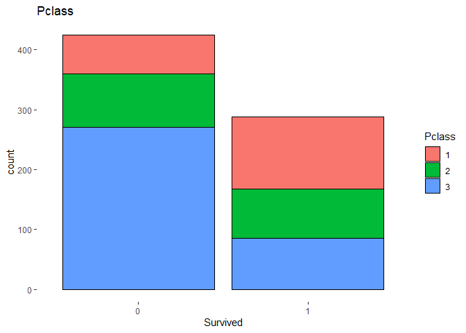
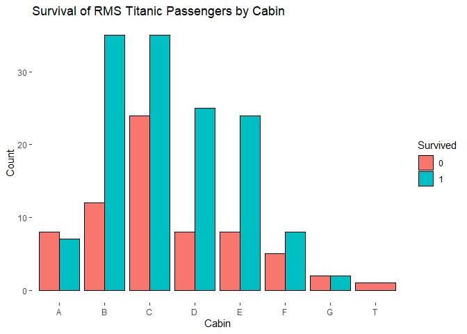

# Trying Out and Ensembling Different Classification Models

**This is the second complete notebook that I am creating. [Here’s a
link to the
first](https://github.com/elijahrona/Elijah-Rona-ML-Journey/blob/master/do-you-have-malaria-or-covid-19.ipynb)
where I worked with Covid-19, Malaria, and Negative patients.**

**The purpose of this notebook is to improve my Recipes(), Workflow(),
and Ensembling (Stacks()) skills.**

# Importing Libraries

``` r
library(tidyverse)
```

    ## -- Attaching packages --------------------------------------- tidyverse 1.3.1 --

    ## v ggplot2 3.3.5     v purrr   0.3.4
    ## v tibble  3.1.2     v dplyr   1.0.7
    ## v tidyr   1.1.3     v stringr 1.4.0
    ## v readr   1.4.0     v forcats 0.5.1

    ## -- Conflicts ------------------------------------------ tidyverse_conflicts() --
    ## x dplyr::filter() masks stats::filter()
    ## x dplyr::lag()    masks stats::lag()

``` r
library(tidymodels)
```

    ## Registered S3 method overwritten by 'tune':
    ##   method                   from   
    ##   required_pkgs.model_spec parsnip

    ## -- Attaching packages -------------------------------------- tidymodels 0.1.3 --

    ## v broom        0.7.10     v rsample      0.1.0 
    ## v dials        0.0.10     v tune         0.1.6 
    ## v infer        0.5.4      v workflows    0.2.3 
    ## v modeldata    0.1.1      v workflowsets 0.1.0 
    ## v parsnip      0.1.7      v yardstick    0.0.8 
    ## v recipes      0.1.16

    ## -- Conflicts ----------------------------------------- tidymodels_conflicts() --
    ## x scales::discard() masks purrr::discard()
    ## x dplyr::filter()   masks stats::filter()
    ## x recipes::fixed()  masks stringr::fixed()
    ## x dplyr::lag()      masks stats::lag()
    ## x yardstick::spec() masks readr::spec()
    ## x recipes::step()   masks stats::step()
    ## * Use tidymodels_prefer() to resolve common conflicts.

# Dataset

``` r
mine <- read.csv("C:/Users/Octopus/Desktop/in-vehicle-coupon-recommendation.csv", stringsAsFactors=TRUE)
head(mine)
```

    ##       destination passanger weather temperature time                coupon
    ## 1 No Urgent Place     Alone   Sunny          55  2PM       Restaurant(<20)
    ## 2 No Urgent Place Friend(s)   Sunny          80 10AM          Coffee House
    ## 3 No Urgent Place Friend(s)   Sunny          80 10AM Carry out & Take away
    ## 4 No Urgent Place Friend(s)   Sunny          80  2PM          Coffee House
    ## 5 No Urgent Place Friend(s)   Sunny          80  2PM          Coffee House
    ## 6 No Urgent Place Friend(s)   Sunny          80  6PM       Restaurant(<20)
    ##   expiration gender age     maritalStatus has_children                education
    ## 1         1d Female  21 Unmarried partner            1 Some college - no degree
    ## 2         2h Female  21 Unmarried partner            1 Some college - no degree
    ## 3         2h Female  21 Unmarried partner            1 Some college - no degree
    ## 4         2h Female  21 Unmarried partner            1 Some college - no degree
    ## 5         1d Female  21 Unmarried partner            1 Some college - no degree
    ## 6         2h Female  21 Unmarried partner            1 Some college - no degree
    ##   occupation          income   Bar CoffeeHouse RestaurantLessThan20
    ## 1 Unemployed $37500 - $49999 never       never                  4~8
    ## 2 Unemployed $37500 - $49999 never       never                  4~8
    ## 3 Unemployed $37500 - $49999 never       never                  4~8
    ## 4 Unemployed $37500 - $49999 never       never                  4~8
    ## 5 Unemployed $37500 - $49999 never       never                  4~8
    ## 6 Unemployed $37500 - $49999 never       never                  4~8
    ##   Restaurant20To50 toCoupon_GEQ15min toCoupon_GEQ25min direction_same
    ## 1              1~3                 0                 0              0
    ## 2              1~3                 0                 0              0
    ## 3              1~3                 1                 0              0
    ## 4              1~3                 1                 0              0
    ## 5              1~3                 1                 0              0
    ## 6              1~3                 1                 0              0
    ##   direction_opp Y
    ## 1             1 1
    ## 2             1 0
    ## 3             1 1
    ## 4             1 0
    ## 5             1 0
    ## 6             1 1

Let’s have a glimpse of what our dataset looks like.

``` r
skimmed <- skimr::skim(mine)
```

    ## Warning in sorted_count(x): Variable contains value(s) of "" that have been
    ## converted to "empty".

    ## Warning in sorted_count(x): Variable contains value(s) of "" that have been
    ## converted to "empty".

    ## Warning in sorted_count(x): Variable contains value(s) of "" that have been
    ## converted to "empty".

    ## Warning in sorted_count(x): Variable contains value(s) of "" that have been
    ## converted to "empty".

``` r
skimmed <- skimmed[, c(1:5, 9:11, 13, 15)]
skimmed
```

|                                                  |       |
|:-------------------------------------------------|:------|
| Name                                             | mine  |
| Number of rows                                   | 12684 |
| Number of columns                                | 23    |
| \_\_\_\_\_\_\_\_\_\_\_\_\_\_\_\_\_\_\_\_\_\_\_   |       |
| Column type frequency:                           |       |
| factor                                           | 16    |
| numeric                                          | 7     |
| \_\_\_\_\_\_\_\_\_\_\_\_\_\_\_\_\_\_\_\_\_\_\_\_ |       |
| Group variables                                  | None  |

Data summary

**Variable type: factor**

| skim_variable        | n_missing | complete_rate | ordered |
|:---------------------|----------:|--------------:|:--------|
| destination          |         0 |             1 | FALSE   |
| passanger            |         0 |             1 | FALSE   |
| weather              |         0 |             1 | FALSE   |
| time                 |         0 |             1 | FALSE   |
| coupon               |         0 |             1 | FALSE   |
| expiration           |         0 |             1 | FALSE   |
| gender               |         0 |             1 | FALSE   |
| age                  |         0 |             1 | FALSE   |
| maritalStatus        |         0 |             1 | FALSE   |
| education            |         0 |             1 | FALSE   |
| occupation           |         0 |             1 | FALSE   |
| income               |         0 |             1 | FALSE   |
| Bar                  |         0 |             1 | FALSE   |
| CoffeeHouse          |         0 |             1 | FALSE   |
| RestaurantLessThan20 |         0 |             1 | FALSE   |
| Restaurant20To50     |         0 |             1 | FALSE   |

**Variable type: numeric**

| skim_variable     | n_missing | complete_rate |    sd |  p0 | p25 | p75 | hist  |
|:------------------|----------:|--------------:|------:|----:|----:|----:|:------|
| temperature       |         0 |             1 | 19.15 |  30 |  55 |  80 | ▃▁▅▁▇ |
| has_children      |         0 |             1 |  0.49 |   0 |   0 |   1 | ▇▁▁▁▆ |
| toCoupon_GEQ15min |         0 |             1 |  0.50 |   0 |   0 |   1 | ▆▁▁▁▇ |
| toCoupon_GEQ25min |         0 |             1 |  0.32 |   0 |   0 |   0 | ▇▁▁▁▁ |
| direction_same    |         0 |             1 |  0.41 |   0 |   0 |   0 | ▇▁▁▁▂ |
| direction_opp     |         0 |             1 |  0.41 |   0 |   1 |   1 | ▂▁▁▁▇ |
| Y                 |         0 |             1 |  0.50 |   0 |   0 |   1 | ▆▁▁▁▇ |

The response variable, Y appears to be numeric. It should be a factor,
so we should convert it with factor(). Also, it seems that the
temperature column has only three numbers, so we should also treat it as
a factor.

``` r
mine <- mine %>%
mutate(temperature = factor(temperature),
      Y = factor(Y))
```

``` r
is.factor(mine$Y)
```

    ## [1] TRUE

# Splitting the Dataset

``` r
ames_split  <- initial_split(mine, 
                             strata = Y,
                             breaks = 4)
ames_train  <- training(ames_split)
ames_test   <- testing(ames_split)
```

# Creating the Recipe

``` r
train_rec <- recipe(Y ~ ., data = ames_train) %>%
step_dummy(all_nominal_predictors())
```

Let’s check if the recipe works. The data below is what it looks like
after processing it with recipe. This is the way our models will read it

``` r
train_rec %>% 
prep(training = ames_train, retain = TRUE) %>%
juice() %>%
head()
```

    ## New names:
    ## * income_X.12500....24999 -> income_X.12500.
    ## * income_X.25000....37499 -> income_X.25000.
    ## * income_X.37500....49999 -> income_X.37500.
    ## * income_X.50000....62499 -> income_X.50000.
    ## * income_X.62500....74999 -> income_X.62500.
    ## * ...

    ## # A tibble: 6 x 93
    ##   has_children toCoupon_GEQ15min toCoupon_GEQ25min direction_same direction_opp
    ##          <int>             <int>             <int>          <int>         <int>
    ## 1            1                 0                 0              0             1
    ## 2            1                 1                 0              0             1
    ## 3            1                 1                 0              0             1
    ## 4            1                 1                 1              0             1
    ## 5            0                 0                 0              0             1
    ## 6            0                 1                 0              0             1
    ## # ... with 88 more variables: Y <fct>, destination_No.Urgent.Place <dbl>,
    ## #   destination_Work <dbl>, passanger_Friend.s. <dbl>, passanger_Kid.s. <dbl>,
    ## #   passanger_Partner <dbl>, weather_Snowy <dbl>, weather_Sunny <dbl>,
    ## #   temperature_X55 <dbl>, temperature_X80 <dbl>, time_X10PM <dbl>,
    ## #   time_X2PM <dbl>, time_X6PM <dbl>, time_X7AM <dbl>,
    ## #   coupon_Carry.out...Take.away <dbl>, coupon_Coffee.House <dbl>,
    ## #   coupon_Restaurant..20. <dbl>, coupon_Restaurant.20.50. <dbl>,
    ## #   expiration_X2h <dbl>, gender_Male <dbl>, age_X26 <dbl>, age_X31 <dbl>,
    ## #   age_X36 <dbl>, age_X41 <dbl>, age_X46 <dbl>, age_X50plus <dbl>,
    ## #   age_below21 <dbl>, maritalStatus_Married.partner <dbl>,
    ## #   maritalStatus_Single <dbl>, maritalStatus_Unmarried.partner <dbl>,
    ## #   maritalStatus_Widowed <dbl>, education_Bachelors.degree <dbl>,
    ## #   education_Graduate.degree..Masters.or.Doctorate. <dbl>,
    ## #   education_High.School.Graduate <dbl>,
    ## #   education_Some.college...no.degree <dbl>, education_Some.High.School <dbl>,
    ## #   occupation_Arts.Design.Entertainment.Sports...Media <dbl>,
    ## #   occupation_Building...Grounds.Cleaning...Maintenance <dbl>,
    ## #   occupation_Business...Financial <dbl>,
    ## #   occupation_Community...Social.Services <dbl>,
    ## #   occupation_Computer...Mathematical <dbl>,
    ## #   occupation_Construction...Extraction <dbl>,
    ## #   occupation_Education.Training.Library <dbl>,
    ## #   occupation_Farming.Fishing...Forestry <dbl>,
    ## #   occupation_Food.Preparation...Serving.Related <dbl>,
    ## #   occupation_Healthcare.Practitioners...Technical <dbl>,
    ## #   occupation_Healthcare.Support <dbl>,
    ## #   occupation_Installation.Maintenance...Repair <dbl>, occupation_Legal <dbl>,
    ## #   occupation_Life.Physical.Social.Science <dbl>, occupation_Management <dbl>,
    ## #   occupation_Office...Administrative.Support <dbl>,
    ## #   occupation_Personal.Care...Service <dbl>,
    ## #   occupation_Production.Occupations <dbl>,
    ## #   occupation_Protective.Service <dbl>, occupation_Retired <dbl>,
    ## #   occupation_Sales...Related <dbl>, occupation_Student <dbl>,
    ## #   occupation_Transportation...Material.Moving <dbl>,
    ## #   occupation_Unemployed <dbl>, income_X.12500. <dbl>, income_X.25000. <dbl>,
    ## #   income_X.37500. <dbl>, income_X.50000. <dbl>, income_X.62500. <dbl>,
    ## #   income_X.75000. <dbl>, income_X.87500. <dbl>,
    ## #   income_Less.than..12500 <dbl>, Bar_X1.3 <dbl>, Bar_X4.8 <dbl>,
    ## #   Bar_gt8 <dbl>, Bar_less1 <dbl>, Bar_never <dbl>, CoffeeHouse_X1.3 <dbl>,
    ## #   CoffeeHouse_X4.8 <dbl>, CoffeeHouse_gt8 <dbl>, CoffeeHouse_less1 <dbl>,
    ## #   CoffeeHouse_never <dbl>, RestaurantLessThan20_X1.3 <dbl>,
    ## #   RestaurantLessThan20_X4.8 <dbl>, RestaurantLessThan20_gt8 <dbl>,
    ## #   RestaurantLessThan20_less1 <dbl>, RestaurantLessThan20_never <dbl>,
    ## #   Restaurant20To50_X1.3 <dbl>, Restaurant20To50_X4.8 <dbl>,
    ## #   Restaurant20To50_gt8 <dbl>, Restaurant20To50_less1 <dbl>,
    ## #   Restaurant20To50_never <dbl>

# Specifying Our Models

We shall be working with four models; Logistic Regression, MARS, Random
Forest (named treebag), and XGBOOST

``` r
log_spec <- logistic_reg(penalty = 10) %>%
  set_engine(engine = "glm") %>%
  set_mode("classification")

mars_spec <- mars() %>%
  set_mode("classification") %>% 
  set_engine("earth")

treebag_spec <- rand_forest() %>%
  set_engine("ranger") %>% 
  set_mode("classification")

xgboost_spec <- boost_tree() %>% 
  set_mode("classification") %>% 
  set_engine("xgboost")
```

# Adding Our Models and Recipe Into Various Workflows

A workflow is created for each model, but with the same recipe

``` r
wf_log <- workflow() %>% 
add_recipe(train_rec) %>% 
add_model(log_spec)

wf_mars <- workflow() %>% 
add_recipe(train_rec) %>% 
add_model(mars_spec)

wf_treebag <- workflow() %>% 
add_recipe(train_rec) %>% 
add_model(treebag_spec)

wf_xgboost <- workflow() %>% 
add_recipe(train_rec) %>% 
add_model(xgboost_spec)
```

# Building Our Logistic Model

First of all, let us start with fitting the train data

``` r
train_fit_log <- 
  wf_log %>% 
  fit(data = ames_train)
```

    ## New names:
    ## * income_X.12500....24999 -> income_X.12500.
    ## * income_X.25000....37499 -> income_X.25000.
    ## * income_X.37500....49999 -> income_X.37500.
    ## * income_X.50000....62499 -> income_X.50000.
    ## * income_X.62500....74999 -> income_X.62500.
    ## * ...

Now we move to predicting the test data. Note that the data was also
processed with the recipe

``` r
pred_log <- augment(train_fit_log, ames_test)
```

    ## New names:
    ## * income_X.12500....24999 -> income_X.12500.
    ## * income_X.25000....37499 -> income_X.25000.
    ## * income_X.37500....49999 -> income_X.37500.
    ## * income_X.50000....62499 -> income_X.50000.
    ## * income_X.62500....74999 -> income_X.62500.
    ## * ...

    ## Warning in predict.lm(object, newdata, se.fit, scale = 1, type = if (type == :
    ## prediction from a rank-deficient fit may be misleading

    ## Warning in predict.lm(object, newdata, se.fit, scale = 1, type = if (type == :
    ## prediction from a rank-deficient fit may be misleading

What is the accuracy of our model prediction?

``` r
LOG_Accuracy <- pred_log %>% 
  accuracy(truth = Y, .pred_class)

LOG_Accuracy[[1,3]]
```

    ## [1] 0.6860025

With an accuracy of 56.8%, there s room for improvement. Let’s plot a
confusion matrix for the model for better visualization.

``` r
p1 <- conf_mat(pred_log, truth = Y, estimate = .pred_class) %>% 
  autoplot(type = "heatmap") +
  labs(title = "Logistic",
       subtitle = LOG_Accuracy[[1,3]])

p1
```

<!-- -->

The Logistic model is not so bad. Let’s see if there are better models.

# Building Our MARS Model

``` r
train_fit_mars <- 
  wf_mars %>% 
  fit(data = ames_train)
```

    ## New names:
    ## * income_X.12500....24999 -> income_X.12500.
    ## * income_X.25000....37499 -> income_X.25000.
    ## * income_X.37500....49999 -> income_X.37500.
    ## * income_X.50000....62499 -> income_X.50000.
    ## * income_X.62500....74999 -> income_X.62500.
    ## * ...

``` r
pred_mars <- augment(train_fit_mars, ames_test)
```

    ## New names:
    ## * income_X.12500....24999 -> income_X.12500.
    ## * income_X.25000....37499 -> income_X.25000.
    ## * income_X.37500....49999 -> income_X.37500.
    ## * income_X.50000....62499 -> income_X.50000.
    ## * income_X.62500....74999 -> income_X.62500.
    ## * ...

``` r
MARS_Accuracy <- pred_mars %>% 
  accuracy(truth = Y, .pred_class)

MARS_Accuracy[[1,3]]
```

    ## [1] 0.6771753

``` r
p2 <- conf_mat(pred_mars, truth = Y, estimate = .pred_class) %>% 
  autoplot(type = "heatmap") +
  labs(title = "MARS",
       subtitle = MARS_Accuracy[[1,3]])

p2
```

<!-- -->

# Building Our Random Forest Model

``` r
train_fit_treebag <- 
  wf_treebag %>% 
  fit(data = ames_train)
```

    ## New names:
    ## * income_X.12500....24999 -> income_X.12500.
    ## * income_X.25000....37499 -> income_X.25000.
    ## * income_X.37500....49999 -> income_X.37500.
    ## * income_X.50000....62499 -> income_X.50000.
    ## * income_X.62500....74999 -> income_X.62500.
    ## * ...

``` r
pred_treebag <- augment(train_fit_treebag, ames_test)
```

    ## New names:
    ## * income_X.12500....24999 -> income_X.12500.
    ## * income_X.25000....37499 -> income_X.25000.
    ## * income_X.37500....49999 -> income_X.37500.
    ## * income_X.50000....62499 -> income_X.50000.
    ## * income_X.62500....74999 -> income_X.62500.
    ## * ...

``` r
TREEBAG_Accuracy <- pred_treebag %>% 
  accuracy(truth = Y, .pred_class)

TREEBAG_Accuracy[[1,3]]
```

    ## [1] 0.7345523

``` r
p3 <- conf_mat(pred_treebag, truth = Y, estimate = .pred_class) %>% 
  autoplot(type = "heatmap") +
  labs(title = "Random Frest",
       subtitle = TREEBAG_Accuracy[[1,3]])

p3
```

<!-- -->

# Building Our XGBOOST Model

``` r
train_fit_xgboost <- 
  wf_xgboost %>% 
  fit(data = ames_train)
```

    ## New names:
    ## * income_X.12500....24999 -> income_X.12500.
    ## * income_X.25000....37499 -> income_X.25000.
    ## * income_X.37500....49999 -> income_X.37500.
    ## * income_X.50000....62499 -> income_X.50000.
    ## * income_X.62500....74999 -> income_X.62500.
    ## * ...

    ## [04:42:42] WARNING: amalgamation/../src/learner.cc:1095: Starting in XGBoost 1.3.0, the default evaluation metric used with the objective 'binary:logistic' was changed from 'error' to 'logloss'. Explicitly set eval_metric if you'd like to restore the old behavior.

``` r
pred_xgboost <- augment(train_fit_xgboost, ames_test)
```

    ## New names:
    ## * income_X.12500....24999 -> income_X.12500.
    ## * income_X.25000....37499 -> income_X.25000.
    ## * income_X.37500....49999 -> income_X.37500.
    ## * income_X.50000....62499 -> income_X.50000.
    ## * income_X.62500....74999 -> income_X.62500.
    ## * ...

``` r
XGBOOST_Accuracy <- pred_xgboost %>% 
  accuracy(truth = Y, .pred_class)

XGBOOST_Accuracy[[1,3]]
```

    ## [1] 0.7250946

``` r
p4 <- conf_mat(pred_xgboost, truth = Y, estimate = .pred_class) %>% 
  autoplot(type = "heatmap") +
  labs(title = "XGBOOST",
       subtitle = XGBOOST_Accuracy[[1,3]])

p4
```

<!-- -->

# Confusion Matrix for Every Model

We can see that the Random Forest model is best while the MARS is the
worst.

``` r
ggpubr::ggarrange(p1,p2,p3,p4,
                   ncol = 2,
                   nrow = 2)
```

<!-- -->

# Ensembling Our Models

Let us start by creating our cross validation folds

``` r
ctrl_grid <- stacks::control_stack_grid()
ctrl_res <- stacks::control_stack_resamples()

folds <- rsample::vfold_cv(ames_train, v = 5)

metric <- metric_set(accuracy, roc_auc)
```

# Preparing the MARS Model for Ensembling

``` r
mars_res <- 
  fit_resamples(
    wf_mars, #workflow
    resamples = folds, #cvfold
    metrics = metric,
    control = ctrl_res
  )
```

    ## New names:
    ## * income_X.12500....24999 -> income_X.12500.
    ## * income_X.25000....37499 -> income_X.25000.
    ## * income_X.37500....49999 -> income_X.37500.
    ## * income_X.50000....62499 -> income_X.50000.
    ## * income_X.62500....74999 -> income_X.62500.
    ## * ...
    ## New names:
    ## * income_X.12500....24999 -> income_X.12500.
    ## * income_X.25000....37499 -> income_X.25000.
    ## * income_X.37500....49999 -> income_X.37500.
    ## * income_X.50000....62499 -> income_X.50000.
    ## * income_X.62500....74999 -> income_X.62500.
    ## * ...
    ## New names:
    ## * income_X.12500....24999 -> income_X.12500.
    ## * income_X.25000....37499 -> income_X.25000.
    ## * income_X.37500....49999 -> income_X.37500.
    ## * income_X.50000....62499 -> income_X.50000.
    ## * income_X.62500....74999 -> income_X.62500.
    ## * ...
    ## New names:
    ## * income_X.12500....24999 -> income_X.12500.
    ## * income_X.25000....37499 -> income_X.25000.
    ## * income_X.37500....49999 -> income_X.37500.
    ## * income_X.50000....62499 -> income_X.50000.
    ## * income_X.62500....74999 -> income_X.62500.
    ## * ...
    ## New names:
    ## * income_X.12500....24999 -> income_X.12500.
    ## * income_X.25000....37499 -> income_X.25000.
    ## * income_X.37500....49999 -> income_X.37500.
    ## * income_X.50000....62499 -> income_X.50000.
    ## * income_X.62500....74999 -> income_X.62500.
    ## * ...
    ## New names:
    ## * income_X.12500....24999 -> income_X.12500.
    ## * income_X.25000....37499 -> income_X.25000.
    ## * income_X.37500....49999 -> income_X.37500.
    ## * income_X.50000....62499 -> income_X.50000.
    ## * income_X.62500....74999 -> income_X.62500.
    ## * ...
    ## New names:
    ## * income_X.12500....24999 -> income_X.12500.
    ## * income_X.25000....37499 -> income_X.25000.
    ## * income_X.37500....49999 -> income_X.37500.
    ## * income_X.50000....62499 -> income_X.50000.
    ## * income_X.62500....74999 -> income_X.62500.
    ## * ...
    ## New names:
    ## * income_X.12500....24999 -> income_X.12500.
    ## * income_X.25000....37499 -> income_X.25000.
    ## * income_X.37500....49999 -> income_X.37500.
    ## * income_X.50000....62499 -> income_X.50000.
    ## * income_X.62500....74999 -> income_X.62500.
    ## * ...
    ## New names:
    ## * income_X.12500....24999 -> income_X.12500.
    ## * income_X.25000....37499 -> income_X.25000.
    ## * income_X.37500....49999 -> income_X.37500.
    ## * income_X.50000....62499 -> income_X.50000.
    ## * income_X.62500....74999 -> income_X.62500.
    ## * ...
    ## New names:
    ## * income_X.12500....24999 -> income_X.12500.
    ## * income_X.25000....37499 -> income_X.25000.
    ## * income_X.37500....49999 -> income_X.37500.
    ## * income_X.50000....62499 -> income_X.50000.
    ## * income_X.62500....74999 -> income_X.62500.
    ## * ...

# Preparing the Random Forest Model for Ensembling

``` r
treebag_res <- 
  fit_resamples(
    wf_treebag, #workflow
    resamples = folds, #cvfold
    metrics = metric,
    control = ctrl_res
  )
```

    ## New names:
    ## * income_X.12500....24999 -> income_X.12500.
    ## * income_X.25000....37499 -> income_X.25000.
    ## * income_X.37500....49999 -> income_X.37500.
    ## * income_X.50000....62499 -> income_X.50000.
    ## * income_X.62500....74999 -> income_X.62500.
    ## * ...
    ## New names:
    ## * income_X.12500....24999 -> income_X.12500.
    ## * income_X.25000....37499 -> income_X.25000.
    ## * income_X.37500....49999 -> income_X.37500.
    ## * income_X.50000....62499 -> income_X.50000.
    ## * income_X.62500....74999 -> income_X.62500.
    ## * ...
    ## New names:
    ## * income_X.12500....24999 -> income_X.12500.
    ## * income_X.25000....37499 -> income_X.25000.
    ## * income_X.37500....49999 -> income_X.37500.
    ## * income_X.50000....62499 -> income_X.50000.
    ## * income_X.62500....74999 -> income_X.62500.
    ## * ...
    ## New names:
    ## * income_X.12500....24999 -> income_X.12500.
    ## * income_X.25000....37499 -> income_X.25000.
    ## * income_X.37500....49999 -> income_X.37500.
    ## * income_X.50000....62499 -> income_X.50000.
    ## * income_X.62500....74999 -> income_X.62500.
    ## * ...
    ## New names:
    ## * income_X.12500....24999 -> income_X.12500.
    ## * income_X.25000....37499 -> income_X.25000.
    ## * income_X.37500....49999 -> income_X.37500.
    ## * income_X.50000....62499 -> income_X.50000.
    ## * income_X.62500....74999 -> income_X.62500.
    ## * ...
    ## New names:
    ## * income_X.12500....24999 -> income_X.12500.
    ## * income_X.25000....37499 -> income_X.25000.
    ## * income_X.37500....49999 -> income_X.37500.
    ## * income_X.50000....62499 -> income_X.50000.
    ## * income_X.62500....74999 -> income_X.62500.
    ## * ...
    ## New names:
    ## * income_X.12500....24999 -> income_X.12500.
    ## * income_X.25000....37499 -> income_X.25000.
    ## * income_X.37500....49999 -> income_X.37500.
    ## * income_X.50000....62499 -> income_X.50000.
    ## * income_X.62500....74999 -> income_X.62500.
    ## * ...
    ## New names:
    ## * income_X.12500....24999 -> income_X.12500.
    ## * income_X.25000....37499 -> income_X.25000.
    ## * income_X.37500....49999 -> income_X.37500.
    ## * income_X.50000....62499 -> income_X.50000.
    ## * income_X.62500....74999 -> income_X.62500.
    ## * ...
    ## New names:
    ## * income_X.12500....24999 -> income_X.12500.
    ## * income_X.25000....37499 -> income_X.25000.
    ## * income_X.37500....49999 -> income_X.37500.
    ## * income_X.50000....62499 -> income_X.50000.
    ## * income_X.62500....74999 -> income_X.62500.
    ## * ...
    ## New names:
    ## * income_X.12500....24999 -> income_X.12500.
    ## * income_X.25000....37499 -> income_X.25000.
    ## * income_X.37500....49999 -> income_X.37500.
    ## * income_X.50000....62499 -> income_X.50000.
    ## * income_X.62500....74999 -> income_X.62500.
    ## * ...

# Preparing the XGBOOST Model for Ensembling

``` r
xgboost_res <- 
  fit_resamples(
    wf_xgboost, #workflow
    resamples = folds, #cvfold
    metrics = metric,
    control = ctrl_res
  )
```

    ## New names:
    ## * income_X.12500....24999 -> income_X.12500.
    ## * income_X.25000....37499 -> income_X.25000.
    ## * income_X.37500....49999 -> income_X.37500.
    ## * income_X.50000....62499 -> income_X.50000.
    ## * income_X.62500....74999 -> income_X.62500.
    ## * ...
    ## New names:
    ## * income_X.12500....24999 -> income_X.12500.
    ## * income_X.25000....37499 -> income_X.25000.
    ## * income_X.37500....49999 -> income_X.37500.
    ## * income_X.50000....62499 -> income_X.50000.
    ## * income_X.62500....74999 -> income_X.62500.
    ## * ...
    ## New names:
    ## * income_X.12500....24999 -> income_X.12500.
    ## * income_X.25000....37499 -> income_X.25000.
    ## * income_X.37500....49999 -> income_X.37500.
    ## * income_X.50000....62499 -> income_X.50000.
    ## * income_X.62500....74999 -> income_X.62500.
    ## * ...
    ## New names:
    ## * income_X.12500....24999 -> income_X.12500.
    ## * income_X.25000....37499 -> income_X.25000.
    ## * income_X.37500....49999 -> income_X.37500.
    ## * income_X.50000....62499 -> income_X.50000.
    ## * income_X.62500....74999 -> income_X.62500.
    ## * ...
    ## New names:
    ## * income_X.12500....24999 -> income_X.12500.
    ## * income_X.25000....37499 -> income_X.25000.
    ## * income_X.37500....49999 -> income_X.37500.
    ## * income_X.50000....62499 -> income_X.50000.
    ## * income_X.62500....74999 -> income_X.62500.
    ## * ...
    ## New names:
    ## * income_X.12500....24999 -> income_X.12500.
    ## * income_X.25000....37499 -> income_X.25000.
    ## * income_X.37500....49999 -> income_X.37500.
    ## * income_X.50000....62499 -> income_X.50000.
    ## * income_X.62500....74999 -> income_X.62500.
    ## * ...
    ## New names:
    ## * income_X.12500....24999 -> income_X.12500.
    ## * income_X.25000....37499 -> income_X.25000.
    ## * income_X.37500....49999 -> income_X.37500.
    ## * income_X.50000....62499 -> income_X.50000.
    ## * income_X.62500....74999 -> income_X.62500.
    ## * ...
    ## New names:
    ## * income_X.12500....24999 -> income_X.12500.
    ## * income_X.25000....37499 -> income_X.25000.
    ## * income_X.37500....49999 -> income_X.37500.
    ## * income_X.50000....62499 -> income_X.50000.
    ## * income_X.62500....74999 -> income_X.62500.
    ## * ...
    ## New names:
    ## * income_X.12500....24999 -> income_X.12500.
    ## * income_X.25000....37499 -> income_X.25000.
    ## * income_X.37500....49999 -> income_X.37500.
    ## * income_X.50000....62499 -> income_X.50000.
    ## * income_X.62500....74999 -> income_X.62500.
    ## * ...
    ## New names:
    ## * income_X.12500....24999 -> income_X.12500.
    ## * income_X.25000....37499 -> income_X.25000.
    ## * income_X.37500....49999 -> income_X.37500.
    ## * income_X.50000....62499 -> income_X.50000.
    ## * income_X.62500....74999 -> income_X.62500.
    ## * ...

# Preparing the Logistic Model for Ensembling

``` r
log_res <- 
  fit_resamples(
    wf_log, #workflow
    resamples = folds, #cvfold
    metrics = metric,
    control = ctrl_res
  )
```

    ## New names:
    ## * income_X.12500....24999 -> income_X.12500.
    ## * income_X.25000....37499 -> income_X.25000.
    ## * income_X.37500....49999 -> income_X.37500.
    ## * income_X.50000....62499 -> income_X.50000.
    ## * income_X.62500....74999 -> income_X.62500.
    ## * ...
    ## New names:
    ## * income_X.12500....24999 -> income_X.12500.
    ## * income_X.25000....37499 -> income_X.25000.
    ## * income_X.37500....49999 -> income_X.37500.
    ## * income_X.50000....62499 -> income_X.50000.
    ## * income_X.62500....74999 -> income_X.62500.
    ## * ...

    ## ! Fold1: preprocessor 1/1, model 1/1 (predictions): prediction from a rank-defici...

    ## New names:
    ## * income_X.12500....24999 -> income_X.12500.
    ## * income_X.25000....37499 -> income_X.25000.
    ## * income_X.37500....49999 -> income_X.37500.
    ## * income_X.50000....62499 -> income_X.50000.
    ## * income_X.62500....74999 -> income_X.62500.
    ## * ...
    ## New names:
    ## * income_X.12500....24999 -> income_X.12500.
    ## * income_X.25000....37499 -> income_X.25000.
    ## * income_X.37500....49999 -> income_X.37500.
    ## * income_X.50000....62499 -> income_X.50000.
    ## * income_X.62500....74999 -> income_X.62500.
    ## * ...

    ## ! Fold2: preprocessor 1/1, model 1/1 (predictions): prediction from a rank-defici...

    ## New names:
    ## * income_X.12500....24999 -> income_X.12500.
    ## * income_X.25000....37499 -> income_X.25000.
    ## * income_X.37500....49999 -> income_X.37500.
    ## * income_X.50000....62499 -> income_X.50000.
    ## * income_X.62500....74999 -> income_X.62500.
    ## * ...
    ## New names:
    ## * income_X.12500....24999 -> income_X.12500.
    ## * income_X.25000....37499 -> income_X.25000.
    ## * income_X.37500....49999 -> income_X.37500.
    ## * income_X.50000....62499 -> income_X.50000.
    ## * income_X.62500....74999 -> income_X.62500.
    ## * ...

    ## ! Fold3: preprocessor 1/1, model 1/1 (predictions): prediction from a rank-defici...

    ## New names:
    ## * income_X.12500....24999 -> income_X.12500.
    ## * income_X.25000....37499 -> income_X.25000.
    ## * income_X.37500....49999 -> income_X.37500.
    ## * income_X.50000....62499 -> income_X.50000.
    ## * income_X.62500....74999 -> income_X.62500.
    ## * ...
    ## New names:
    ## * income_X.12500....24999 -> income_X.12500.
    ## * income_X.25000....37499 -> income_X.25000.
    ## * income_X.37500....49999 -> income_X.37500.
    ## * income_X.50000....62499 -> income_X.50000.
    ## * income_X.62500....74999 -> income_X.62500.
    ## * ...

    ## ! Fold4: preprocessor 1/1, model 1/1 (predictions): prediction from a rank-defici...

    ## New names:
    ## * income_X.12500....24999 -> income_X.12500.
    ## * income_X.25000....37499 -> income_X.25000.
    ## * income_X.37500....49999 -> income_X.37500.
    ## * income_X.50000....62499 -> income_X.50000.
    ## * income_X.62500....74999 -> income_X.62500.
    ## * ...
    ## New names:
    ## * income_X.12500....24999 -> income_X.12500.
    ## * income_X.25000....37499 -> income_X.25000.
    ## * income_X.37500....49999 -> income_X.37500.
    ## * income_X.50000....62499 -> income_X.50000.
    ## * income_X.62500....74999 -> income_X.62500.
    ## * ...

    ## ! Fold5: preprocessor 1/1, model 1/1 (predictions): prediction from a rank-defici...

# Adding Every Model to Our Stack

``` r
library(stacks)
model_data_st <-  stacks() %>%
  add_candidates(log_res) %>%
  add_candidates(treebag_res) %>%
  add_candidates(xgboost_res) %>%
  add_candidates(mars_res)

head(model_data_st)
```

    ## # A data stack with 4 model definitions and 4 candidate members:
    ## #   log_res: 1 model configuration
    ## #   treebag_res: 1 model configuration
    ## #   xgboost_res: 1 model configuration
    ## #   mars_res: 1 model configuration
    ## # Outcome: Y (factor)

There are several class probabilities. To know the combined model
prediction, we will use the blend_predictions() function.

``` r
fitted_model_st <-
  model_data_st %>%
  blend_predictions()
```

Let us expore our ensambled model to know how the members are
performing.

``` r
theme_set(theme_bw())
autoplot(fitted_model_st)
```

<!-- -->

``` r
autoplot(fitted_model_st, type = "members")
```

<!-- -->

``` r
autoplot(fitted_model_st, type = "weights")
```

<!-- -->

``` r
fitted_model_st
```

    ## -- A stacked ensemble model -------------------------------------

    ## 
    ## Out of 4 possible candidate members, the ensemble retained 2.
    ## Penalty: 1e-05.
    ## Mixture: 1.

    ## 
    ## The 2 highest weighted member classes are:

    ## # A tibble: 2 x 3
    ##   member                  type        weight
    ##   <chr>                   <chr>        <dbl>
    ## 1 .pred_1_treebag_res_1_1 rand_forest   6.05
    ## 2 .pred_1_xgboost_res_1_1 boost_tree    1.15

    ## 
    ## Members have not yet been fitted with `fit_members()`.

The final model retained just two of our models; Random Forest and
XGBOOST. Let us combine these models to predict our test data.

``` r
fitted_model_st <-
  fitted_model_st %>%
  fit_members()
```

    ## New names:
    ## * income_X.12500....24999 -> income_X.12500.
    ## * income_X.25000....37499 -> income_X.25000.
    ## * income_X.37500....49999 -> income_X.37500.
    ## * income_X.50000....62499 -> income_X.50000.
    ## * income_X.62500....74999 -> income_X.62500.
    ## * ...
    ## New names:
    ## * income_X.12500....24999 -> income_X.12500.
    ## * income_X.25000....37499 -> income_X.25000.
    ## * income_X.37500....49999 -> income_X.37500.
    ## * income_X.50000....62499 -> income_X.50000.
    ## * income_X.62500....74999 -> income_X.62500.
    ## * ...

    ## [04:47:28] WARNING: amalgamation/../src/learner.cc:1095: Starting in XGBoost 1.3.0, the default evaluation metric used with the objective 'binary:logistic' was changed from 'error' to 'logloss'. Explicitly set eval_metric if you'd like to restore the old behavior.

``` r
test_predict_data <- 
  ames_test %>%
  bind_cols(predict(fitted_model_st, .))
```

    ## New names:
    ## * income_X.12500....24999 -> income_X.12500.
    ## * income_X.25000....37499 -> income_X.25000.
    ## * income_X.37500....49999 -> income_X.37500.
    ## * income_X.50000....62499 -> income_X.50000.
    ## * income_X.62500....74999 -> income_X.62500.
    ## * ...
    ## New names:
    ## * income_X.12500....24999 -> income_X.12500.
    ## * income_X.25000....37499 -> income_X.25000.
    ## * income_X.37500....49999 -> income_X.37500.
    ## * income_X.50000....62499 -> income_X.50000.
    ## * income_X.62500....74999 -> income_X.62500.
    ## * ...

# Prediting the test data

``` r
member_preds <- 
  test_predict_data %>%
  select(Y) %>%
  bind_cols(predict(fitted_model_st, ames_test, members = TRUE))
```

    ## New names:
    ## * income_X.12500....24999 -> income_X.12500.
    ## * income_X.25000....37499 -> income_X.25000.
    ## * income_X.37500....49999 -> income_X.37500.
    ## * income_X.50000....62499 -> income_X.50000.
    ## * income_X.62500....74999 -> income_X.62500.
    ## * ...
    ## New names:
    ## * income_X.12500....24999 -> income_X.12500.
    ## * income_X.25000....37499 -> income_X.25000.
    ## * income_X.37500....49999 -> income_X.37500.
    ## * income_X.50000....62499 -> income_X.50000.
    ## * income_X.62500....74999 -> income_X.62500.
    ## * ...

``` r
head(member_preds)
```

    ##   Y .pred_class .pred_class_treebag_res_1_1 .pred_class_xgboost_res_1_1
    ## 1 1           1                           1                           1
    ## 2 0           0                           0                           0
    ## 3 1           1                           1                           1
    ## 4 1           0                           0                           0
    ## 5 0           0                           0                           0
    ## 6 1           0                           0                           0

Let us compare the accuracy of the combined model with that of the other
member models

``` r
map_dfr(member_preds, accuracy, truth = Y, data = member_preds) %>%
  mutate(member = colnames(member_preds))
```

    ## # A tibble: 4 x 4
    ##   .metric  .estimator .estimate member                     
    ##   <chr>    <chr>          <dbl> <chr>                      
    ## 1 accuracy binary         1     Y                          
    ## 2 accuracy binary         0.732 .pred_class                
    ## 3 accuracy binary         0.739 .pred_class_treebag_res_1_1
    ## 4 accuracy binary         0.725 .pred_class_xgboost_res_1_1

After every model learned from each other, the model with the highest
accuracy is Random Forest (74.55%) while the combined model came second
(74.14%). XGBOOST came last (72.06%).

``` r
p1 <- conf_mat(member_preds, truth = Y, estimate = .pred_class) %>% 
  autoplot(type = "heatmap") +
  labs(title = "Ensembled")

p2 <- conf_mat(member_preds, truth = Y, estimate = .pred_class_treebag_res_1_1) %>% 
  autoplot(type = "heatmap") +
  labs(title = "Random Forest")

p3 <- conf_mat(member_preds, truth = Y, estimate = .pred_class_treebag_res_1_1) %>% 
  autoplot(type = "heatmap") +
  labs(title = "XGBOOST")

ggpubr::ggarrange(p1,p2,p3,
          ncol = 2,
          nrow = 2)
```

<!-- -->

# Thanks for Reading
