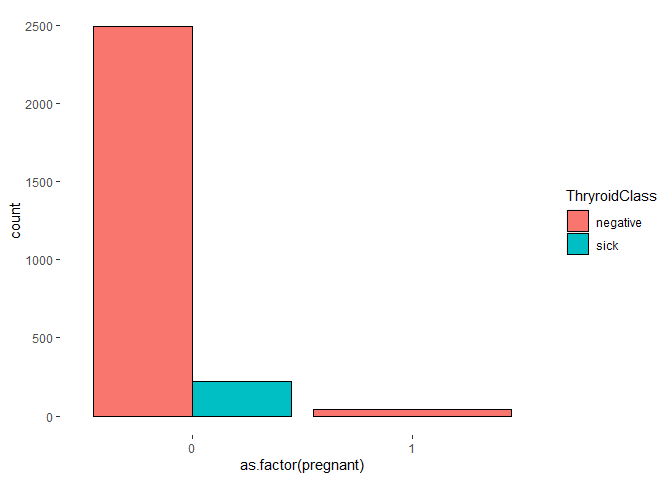
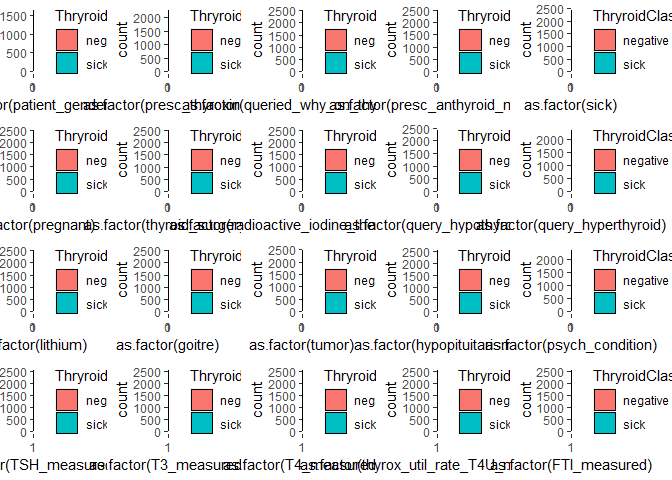
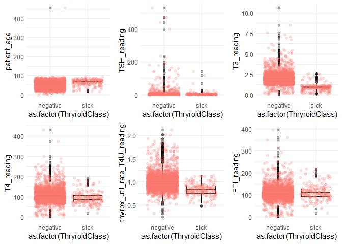
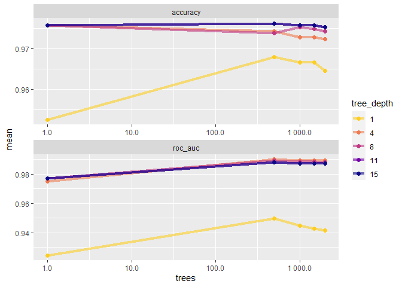
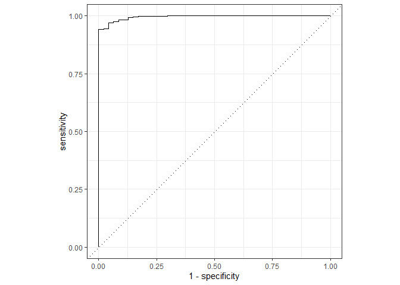
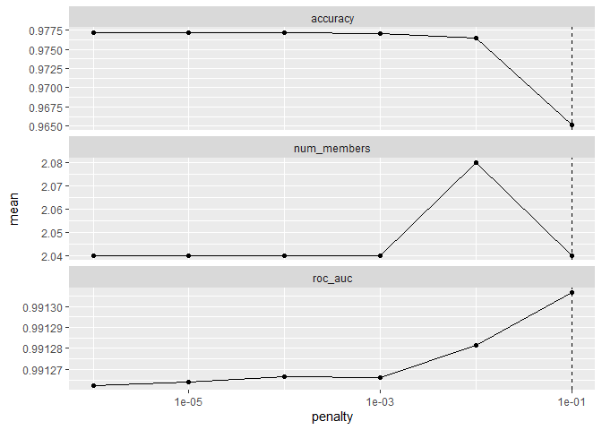
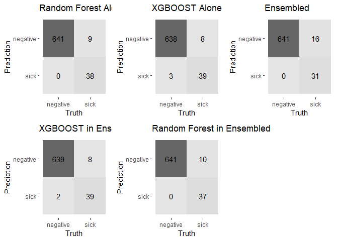

Thyroid Disease EDA, Classification and Ensembling
================

# Thyroid Disease EDA, Classification and Ensembling

Predicting from the MLDataR package

The purpose of this notebook is to build my Data Sciece and Machine
Learning skills. This is my third complete notebook. You can check other
notebooks at my [github
repository](https://github.com/elijahrona/Elijah-Rona-ML-Journey).
Follow my everyday ML journey on
[Twitter](https://twitter.com/elijah_rona).

## Loading Libraries

``` r
library(MLDataR) #Source of dataset
library(tidyverse) #EDA plus others
```

    ## -- Attaching packages --------------------------------------- tidyverse 1.3.1 --

    ## v ggplot2 3.3.5     v purrr   0.3.4
    ## v tibble  3.1.2     v dplyr   1.0.7
    ## v tidyr   1.1.3     v stringr 1.4.0
    ## v readr   1.4.0     v forcats 0.5.1

    ## -- Conflicts ------------------------------------------ tidyverse_conflicts() --
    ## x dplyr::filter() masks stats::filter()
    ## x dplyr::lag()    masks stats::lag()

``` r
library(tidymodels) #Machine Leaning
```

    ## Registered S3 method overwritten by 'tune':
    ##   method                   from   
    ##   required_pkgs.model_spec parsnip

    ## -- Attaching packages -------------------------------------- tidymodels 0.1.3 --

    ## v broom        0.7.10     v rsample      0.1.0 
    ## v dials        0.0.10     v tune         0.1.6 
    ## v infer        0.5.4      v workflows    0.2.3 
    ## v modeldata    0.1.1      v workflowsets 0.1.0 
    ## v parsnip      0.1.7      v yardstick    0.0.8 
    ## v recipes      0.1.16

    ## -- Conflicts ----------------------------------------- tidymodels_conflicts() --
    ## x scales::discard() masks purrr::discard()
    ## x dplyr::filter()   masks stats::filter()
    ## x recipes::fixed()  masks stringr::fixed()
    ## x dplyr::lag()      masks stats::lag()
    ## x yardstick::spec() masks readr::spec()
    ## x recipes::step()   masks stats::step()
    ## * Use tidymodels_prefer() to resolve common conflicts.

``` r
library(skimr) #Data exploration
library(stacks) #Ensembling
library(ggpubr) #Plot arrangements
```

## Loading and Exploring the Dataset

``` r
df <- thyroid_disease #from the library

#Let us explore the dataset
skimmed <- skim(df)
head(skimmed)
```

|                                                  |      |
|:-------------------------------------------------|:-----|
| Name                                             | df   |
| Number of rows                                   | 3772 |
| Number of columns                                | 28   |
| \_\_\_\_\_\_\_\_\_\_\_\_\_\_\_\_\_\_\_\_\_\_\_   |      |
| Column type frequency:                           |      |
| character                                        | 2    |
| numeric                                          | 4    |
| \_\_\_\_\_\_\_\_\_\_\_\_\_\_\_\_\_\_\_\_\_\_\_\_ |      |
| Group variables                                  | None |

Data summary

**Variable type: character**

| skim_variable | n_missing | complete_rate | min | max | empty | n_unique | whitespace |
|:--------------|----------:|--------------:|----:|----:|------:|---------:|-----------:|
| ThryroidClass |         0 |             1 |   4 |   8 |     0 |        2 |          0 |
| ref_src       |         0 |             1 |   3 |   5 |     0 |        5 |          0 |

**Variable type: numeric**

| skim_variable            | n_missing | complete_rate |  mean |    sd |  p0 | p25 | p50 | p75 | p100 | hist  |
|:-------------------------|----------:|--------------:|------:|------:|----:|----:|----:|----:|-----:|:------|
| patient_age              |         1 |             1 | 51.74 | 20.08 |   1 |  36 |  54 |  67 |  455 | ▇▁▁▁▁ |
| patient_gender           |         0 |             1 |  0.66 |  0.47 |   0 |   0 |   1 |   1 |    1 | ▅▁▁▁▇ |
| presc_thyroxine          |         0 |             1 |  0.12 |  0.33 |   0 |   0 |   0 |   0 |    1 | ▇▁▁▁▁ |
| queried_why_on_thyroxine |         0 |             1 |  0.01 |  0.11 |   0 |   0 |   0 |   0 |    1 | ▇▁▁▁▁ |

``` r
df <- df[complete.cases(df),]
dim(df)
```

    ## [1] 2751   28

``` r
head(df)
```

    ##    ThryroidClass patient_age patient_gender presc_thyroxine
    ## 1       negative          41              1               0
    ## 5       negative          70              1               0
    ## 8           sick          80              1               0
    ## 9       negative          66              1               0
    ## 10      negative          68              0               0
    ## 11      negative          84              1               0
    ##    queried_why_on_thyroxine presc_anthyroid_meds sick pregnant thyroid_surgery
    ## 1                         0                    0    0        0               0
    ## 5                         0                    0    0        0               0
    ## 8                         0                    0    0        0               0
    ## 9                         0                    0    0        0               0
    ## 10                        0                    0    0        0               0
    ## 11                        0                    0    0        0               0
    ##    radioactive_iodine_therapyI131 query_hypothyroid query_hyperthyroid lithium
    ## 1                               0                 0                  0       0
    ## 5                               0                 0                  0       0
    ## 8                               0                 0                  0       0
    ## 9                               0                 0                  0       0
    ## 10                              0                 0                  0       0
    ## 11                              0                 0                  0       0
    ##    goitre tumor hypopituitarism psych_condition TSH_measured TSH_reading
    ## 1       0     0               0               0            1        1.30
    ## 5       0     0               0               0            1        0.72
    ## 8       0     0               0               0            1        2.20
    ## 9       0     1               0               0            1        0.60
    ## 10      0     0               0               0            1        2.40
    ## 11      0     1               0               0            1        1.10
    ##    T3_measured T3_reading T4_measured T4_reading thyrox_util_rate_T4U_measured
    ## 1            1        2.5           1        125                             1
    ## 5            1        1.2           1         61                             1
    ## 8            1        0.6           1         80                             1
    ## 9            1        2.2           1        123                             1
    ## 10           1        1.6           1         83                             1
    ## 11           1        2.2           1        115                             1
    ##    thyrox_util_rate_T4U_reading FTI_measured FTI_reading ref_src
    ## 1                          1.14            1         109    SVHC
    ## 5                          0.87            1          70     SVI
    ## 8                          0.70            1         115     SVI
    ## 9                          0.93            1         132     SVI
    ## 10                         0.89            1          93     SVI
    ## 11                         0.95            1         121     SVI

The data looks okay and is ready for EDA and Modeling

## Exploratory Data Analysis

Let us create a loop fuction to create several plots to help understand
our data better

``` r
#Assign the variables
predicator <- names(df)[2:27]
predicator <- predicator[-c(1, 18, 20, 22, 24, 26)]
predicator <- set_names(predicator)
response <- names(df)[1]
response <- set_names(response)

#create loop function
chart_fun <- function(x, y) {
  ggplot(df, aes(fill=.data[[y]], x=as.factor(.data[[x]]))) + 
    geom_bar(position="dodge", stat="count", colour="black") +
    theme(
      panel.background = element_rect(fill = "white",
                                      colour = "white",
                                      size = 0.5, linetype = "solid"))
}

#plot charts
finally <- map(response, ~map(predicator, chart_fun, y = .x))
```

Let us test the function if it works with the “Pregnant” column

``` r
library(repr) ;
options(repr.plot.width=16, repr.plot.height = 9)
finally$ThryroidClass$pregnant
```

<!-- -->

It works!! Time to combine all plots

``` r
cowplot::plot_grid(plotlist = finally[[1]], scale = 1)
```

<!-- -->

Explaining these plots can be quite difficult, so let us use statistical
EDA through which we can know if each column is effective in predicting
the response column or not.

Note that for the plots above, we only used columns with 1s and 0s (Just
like the response column). The best form of stat EDA for such columns is
chi-square. Note that if the P-Value is lower than 0.05, we will accept
that the column is a good predicator.

``` r
chi_square_results <- purrr::map(df[,predicator[-c(16:20)]], ~chisq.test(.x, df$ThryroidClass))
```

    ## Warning in chisq.test(.x, df$ThryroidClass): Chi-squared approximation may be
    ## incorrect

    ## Warning in chisq.test(.x, df$ThryroidClass): Chi-squared approximation may be
    ## incorrect

    ## Warning in chisq.test(.x, df$ThryroidClass): Chi-squared approximation may be
    ## incorrect

    ## Warning in chisq.test(.x, df$ThryroidClass): Chi-squared approximation may be
    ## incorrect

    ## Warning in chisq.test(.x, df$ThryroidClass): Chi-squared approximation may be
    ## incorrect

    ## Warning in chisq.test(.x, df$ThryroidClass): Chi-squared approximation may be
    ## incorrect

    ## Warning in chisq.test(.x, df$ThryroidClass): Chi-squared approximation may be
    ## incorrect

    ## Warning in chisq.test(.x, df$ThryroidClass): Chi-squared approximation may be
    ## incorrect

    ## Warning in chisq.test(.x, df$ThryroidClass): Chi-squared approximation may be
    ## incorrect

``` r
chi_square_results
```

    ## $patient_gender
    ## 
    ##  Pearson's Chi-squared test with Yates' continuity correction
    ## 
    ## data:  .x and df$ThryroidClass
    ## X-squared = 1.4869, df = 1, p-value = 0.2227
    ## 
    ## 
    ## $presc_thyroxine
    ## 
    ##  Pearson's Chi-squared test with Yates' continuity correction
    ## 
    ## data:  .x and df$ThryroidClass
    ## X-squared = 5.115, df = 1, p-value = 0.02372
    ## 
    ## 
    ## $queried_why_on_thyroxine
    ## 
    ##  Pearson's Chi-squared test with Yates' continuity correction
    ## 
    ## data:  .x and df$ThryroidClass
    ## X-squared = 0.20611, df = 1, p-value = 0.6498
    ## 
    ## 
    ## $presc_anthyroid_meds
    ## 
    ##  Pearson's Chi-squared test with Yates' continuity correction
    ## 
    ## data:  .x and df$ThryroidClass
    ## X-squared = 1.8804, df = 1, p-value = 0.1703
    ## 
    ## 
    ## $sick
    ## 
    ##  Pearson's Chi-squared test with Yates' continuity correction
    ## 
    ## data:  .x and df$ThryroidClass
    ## X-squared = 25.251, df = 1, p-value = 5.033e-07
    ## 
    ## 
    ## $pregnant
    ## 
    ##  Pearson's Chi-squared test with Yates' continuity correction
    ## 
    ## data:  .x and df$ThryroidClass
    ## X-squared = 2.7372, df = 1, p-value = 0.09804
    ## 
    ## 
    ## $thyroid_surgery
    ## 
    ##  Pearson's Chi-squared test with Yates' continuity correction
    ## 
    ## data:  .x and df$ThryroidClass
    ## X-squared = 1.9652, df = 1, p-value = 0.161
    ## 
    ## 
    ## $radioactive_iodine_therapyI131
    ## 
    ##  Pearson's Chi-squared test with Yates' continuity correction
    ## 
    ## data:  .x and df$ThryroidClass
    ## X-squared = 1.2494, df = 1, p-value = 0.2637
    ## 
    ## 
    ## $query_hypothyroid
    ## 
    ##  Pearson's Chi-squared test with Yates' continuity correction
    ## 
    ## data:  .x and df$ThryroidClass
    ## X-squared = 17.909, df = 1, p-value = 2.317e-05
    ## 
    ## 
    ## $query_hyperthyroid
    ## 
    ##  Pearson's Chi-squared test with Yates' continuity correction
    ## 
    ## data:  .x and df$ThryroidClass
    ## X-squared = 3.1288, df = 1, p-value = 0.07692
    ## 
    ## 
    ## $lithium
    ## 
    ##  Pearson's Chi-squared test with Yates' continuity correction
    ## 
    ## data:  .x and df$ThryroidClass
    ## X-squared = 1.5938e-28, df = 1, p-value = 1
    ## 
    ## 
    ## $goitre
    ## 
    ##  Pearson's Chi-squared test with Yates' continuity correction
    ## 
    ## data:  .x and df$ThryroidClass
    ## X-squared = 0.004973, df = 1, p-value = 0.9438
    ## 
    ## 
    ## $tumor
    ## 
    ##  Pearson's Chi-squared test with Yates' continuity correction
    ## 
    ## data:  .x and df$ThryroidClass
    ## X-squared = 1.187, df = 1, p-value = 0.2759
    ## 
    ## 
    ## $hypopituitarism
    ## 
    ##  Pearson's Chi-squared test with Yates' continuity correction
    ## 
    ## data:  .x and df$ThryroidClass
    ## X-squared = 2.4272, df = 1, p-value = 0.1192
    ## 
    ## 
    ## $psych_condition
    ## 
    ##  Pearson's Chi-squared test with Yates' continuity correction
    ## 
    ## data:  .x and df$ThryroidClass
    ## X-squared = 4.3936, df = 1, p-value = 0.03607

There are many columns with P-Value lower than 0.05. This means that
they are effective in predicting the response column. We, however, will
use every column.

Time to do EDA for the other normal continous columns

``` r
#get columns by index (You can call columns with this...)
predicator1 <- names(df)[2:27]
predicator1 <- predicator1[c(1, 18, 20, 22, 24, 26)]
predicator1 <- set_names(predicator1)

chart_fun1 <- function(x, y) {
  ggplot(df, aes(y=.data[[x]], x=as.factor(.data[[y]]))) + 
    geom_boxplot(fill = 'bisque', color = 'black', alpha = 0.3) +
    geom_jitter(aes(color = 'blue'), alpha = 0.2) +
    guides(color = "none") +
    theme_minimal() +
    coord_cartesian(ylim = quantile(.data[[x]], c(0, 0.999)))
}

finally1 <- map(response, ~map(predicator1, chart_fun1, y = .x))

cowplot::plot_grid(plotlist = finally1[[1]])
```

<!-- -->

We can see from the boxplots that older people are more likely to have
thyroid. To further understand all columns, let us use ANOVA. Same
principle of P-Value applies here

``` r
anova_results <- purrr::map(df[,predicator1], ~summary(aov(.x ~ df$ThryroidClass)))
anova_results
```

    ## $patient_age
    ##                    Df  Sum Sq Mean Sq F value Pr(>F)    
    ## df$ThryroidClass    1   29701   29701   73.57 <2e-16 ***
    ## Residuals        2749 1109735     404                   
    ## ---
    ## Signif. codes:  0 '***' 0.001 '**' 0.01 '*' 0.05 '.' 0.1 ' ' 1
    ## 
    ## $TSH_reading
    ##                    Df  Sum Sq Mean Sq F value Pr(>F)
    ## df$ThryroidClass    1     152   151.6   0.239  0.625
    ## Residuals        2749 1740434   633.1               
    ## 
    ## $T3_reading
    ##                    Df Sum Sq Mean Sq F value Pr(>F)    
    ## df$ThryroidClass    1    289  289.00   507.4 <2e-16 ***
    ## Residuals        2749   1566    0.57                   
    ## ---
    ## Signif. codes:  0 '***' 0.001 '**' 0.01 '*' 0.05 '.' 0.1 ' ' 1
    ## 
    ## $T4_reading
    ##                    Df  Sum Sq Mean Sq F value   Pr(>F)    
    ## df$ThryroidClass    1   54785   54785   44.14 3.66e-11 ***
    ## Residuals        2749 3411677    1241                     
    ## ---
    ## Signif. codes:  0 '***' 0.001 '**' 0.01 '*' 0.05 '.' 0.1 ' ' 1
    ## 
    ## $thyrox_util_rate_T4U_reading
    ##                    Df Sum Sq Mean Sq F value Pr(>F)    
    ## df$ThryroidClass    1   6.18   6.184   170.2 <2e-16 ***
    ## Residuals        2749  99.88   0.036                   
    ## ---
    ## Signif. codes:  0 '***' 0.001 '**' 0.01 '*' 0.05 '.' 0.1 ' ' 1
    ## 
    ## $FTI_reading
    ##                    Df  Sum Sq Mean Sq F value Pr(>F)
    ## df$ThryroidClass    1    1306    1306   1.216   0.27
    ## Residuals        2749 2953418    1074

Now that we know which column is a good predicator and which is not, it
is time to build our model

## Building Out Models

### 1. Splitting Our Dataset

``` r
#Make sure that the response is a factor
df <- df %>%
  mutate(ThryroidClass = as.factor(ThryroidClass))

#split the dataset
set.seed(123)
td_split  <- initial_split(df, 
                             strata = ThryroidClass,
                             breaks = 4)
td_train  <- training(td_split)
td_test   <- testing(td_split)
```

### 2. Making a Recipe

``` r
td_recipe <- recipe(ThryroidClass ~ ., data = td_train) %>% #Set the formula
  remove_role(ref_src, old_role = "predictor") %>% #We do not want to use the "ref_src" column
  step_normalize(all_numeric_predictors()) %>% #Normalize every numeric predicator
  step_zv(all_predictors()) #Remove predicators with only one value (they are useless)
```

Let us test the recipe

``` r
rec_sam <- td_recipe %>% 
  prep(training = td_train, retain = TRUE) %>% #so_train is train data
  juice()

head(rec_sam)
```

    ## # A tibble: 6 x 23
    ##   patient_age patient_gender presc_thyroxine queried_why_on_th~ presc_anthyroid~
    ##         <dbl>          <dbl>           <dbl>              <dbl>            <dbl>
    ## 1      -0.561          0.749          -0.330            -0.0964           -0.108
    ## 2       0.831          0.749          -0.330            -0.0964           -0.108
    ## 3       0.639          0.749          -0.330            -0.0964           -0.108
    ## 4       0.735         -1.33           -0.330            -0.0964           -0.108
    ## 5       0.879          0.749          -0.330            -0.0964           -0.108
    ## 6       0.303          0.749          -0.330            -0.0964           -0.108
    ## # ... with 18 more variables: sick <dbl>, pregnant <dbl>,
    ## #   thyroid_surgery <dbl>, radioactive_iodine_therapyI131 <dbl>,
    ## #   query_hypothyroid <dbl>, query_hyperthyroid <dbl>, lithium <dbl>,
    ## #   goitre <dbl>, tumor <dbl>, hypopituitarism <dbl>, psych_condition <dbl>,
    ## #   TSH_reading <dbl>, T3_reading <dbl>, T4_reading <dbl>,
    ## #   thyrox_util_rate_T4U_reading <dbl>, FTI_reading <dbl>, ref_src <fct>,
    ## #   ThryroidClass <fct>

The dataset above is exactly what out recipe produced. This is what we
will train our model with

### 3 (A). Training a Model (Random Forest-Ranger)

``` r
#Specify the model and mode
td_rf <-
  rand_forest() %>%
  set_engine("ranger") %>% 
  set_mode("classification")

#Make a workflow. We add the recipe we creatd earlier
td_rf_wf <- 
  workflow() %>% 
  add_recipe(td_recipe) %>% 
  add_model(td_rf)

# Fit Model
set.seed(234)
td_rf_fit <- 
  td_rf_wf %>% 
  fit(data = td_train)
```

Let us predict with our test data

``` r
td_rf_pred <- augment(td_rf_fit, td_test)
```

### 3 (B). Evaluating Our Model (Random Forest=Ranger)

``` r
td_rf_pred %>%
  roc_auc(truth = ThryroidClass, 
            estimate = .pred_negative)
```

    ## # A tibble: 1 x 3
    ##   .metric .estimator .estimate
    ##   <chr>   <chr>          <dbl>
    ## 1 roc_auc binary         0.998

``` r
td_rf_pred %>%
  roc_curve(truth = ThryroidClass, 
            estimate = .pred_negative) %>% 
  autoplot()
```

<!-- -->

The Roc_AUC is wonderful

``` r
caret::confusionMatrix(reference = td_rf_pred$ThryroidClass, data = td_rf_pred$.pred_class, mode='everything', positive='sick')
```

    ## Confusion Matrix and Statistics
    ## 
    ##           Reference
    ## Prediction negative sick
    ##   negative      641    9
    ##   sick            0   38
    ##                                          
    ##                Accuracy : 0.9869         
    ##                  95% CI : (0.9753, 0.994)
    ##     No Information Rate : 0.9317         
    ##     P-Value [Acc > NIR] : 4.837e-12      
    ##                                          
    ##                   Kappa : 0.8872         
    ##                                          
    ##  Mcnemar's Test P-Value : 0.007661       
    ##                                          
    ##             Sensitivity : 0.80851        
    ##             Specificity : 1.00000        
    ##          Pos Pred Value : 1.00000        
    ##          Neg Pred Value : 0.98615        
    ##               Precision : 1.00000        
    ##                  Recall : 0.80851        
    ##                      F1 : 0.89412        
    ##              Prevalence : 0.06831        
    ##          Detection Rate : 0.05523        
    ##    Detection Prevalence : 0.05523        
    ##       Balanced Accuracy : 0.90426        
    ##                                          
    ##        'Positive' Class : sick           
    ## 

With an accuracy of 98%, this model is almost perfect. Well, let us try
other models

### 4 (A). Building Our Model (XGBOOST)

\#We will be tuning this model

``` r
#Get the tuning parameters of a model
args(boost_tree)
```

    ## function (mode = "unknown", engine = "xgboost", mtry = NULL, 
    ##     trees = NULL, min_n = NULL, tree_depth = NULL, learn_rate = NULL, 
    ##     loss_reduction = NULL, sample_size = NULL, stop_iter = NULL) 
    ## NULL

``` r
#Specify the model
td_xgboost <- boost_tree(trees = tune(), tree_depth = tune()) %>% 
  set_mode("classification") %>% 
  set_engine("xgboost")

#Set the selected tuning parameters in grid
boost_grid <- grid_regular( #chooses sensible values to try for each hyperparameter
  trees(), tree_depth(),levels = 5)

#Create folds
set.seed(234)
folds <- vfold_cv(td_train)

#Add model and recipe to workflow
td_xgboost_wf <- workflow() %>%
  add_model(td_xgboost) %>%
  add_recipe(td_recipe)

#Start testing different parameters in different grids according to the settings
set.seed(124)
td_xgboost_fold <- td_xgboost_wf %>% 
  tune_grid(resamples = folds, grid = boost_grid)
```

What is the best hyperparameter combination?

``` r
head(collect_metrics(td_xgboost_fold))
```

    ## # A tibble: 6 x 8
    ##   trees tree_depth .metric  .estimator  mean     n std_err .config              
    ##   <int>      <int> <chr>    <chr>      <dbl> <int>   <dbl> <chr>                
    ## 1     1          1 accuracy binary     0.952    10 0.00474 Preprocessor1_Model01
    ## 2     1          1 roc_auc  binary     0.924    10 0.0129  Preprocessor1_Model01
    ## 3   500          1 accuracy binary     0.968    10 0.00357 Preprocessor1_Model02
    ## 4   500          1 roc_auc  binary     0.950    10 0.0113  Preprocessor1_Model02
    ## 5  1000          1 accuracy binary     0.967    10 0.00320 Preprocessor1_Model03
    ## 6  1000          1 roc_auc  binary     0.945    10 0.0116  Preprocessor1_Model03

``` r
best_boost <- td_xgboost_fold %>%
  select_best("accuracy")

best_boost
```

    ## # A tibble: 1 x 3
    ##   trees tree_depth .config              
    ##   <int>      <int> <chr>                
    ## 1   500         11 Preprocessor1_Model17

Let us visualize the varirous hyperparameters used

``` r
td_xgboost_fold %>%
  collect_metrics() %>%
  mutate(tree_depth = factor(tree_depth)) %>%
  ggplot(aes(trees, mean, color = tree_depth)) +
  geom_line(size = 1.5, alpha = 0.6) +
  geom_point(size = 2) +
  facet_wrap(~ .metric, scales = "free", nrow = 2) +
  scale_x_log10(labels = scales::label_number()) +
  scale_color_viridis_d(option = "plasma", begin = .9, end = 0)
```

<!-- -->

Since we saved the best hyperparameter combination as “best_boost”, we
will use that variable in out model

``` r
#Using the best hyperparameters
final_xgboost_wf <- 
  td_xgboost_wf %>% 
  finalize_workflow(best_boost)

#Fitting out model
final_xgboost_fit <- 
  final_xgboost_wf %>%
  last_fit(td_split) #last_fit trains with train data and tests test data automatically
```

### 4 (B). Evaluating Our Model (XGBOOST)

``` r
collect_metrics(final_xgboost_fit)
```

    ## # A tibble: 2 x 4
    ##   .metric  .estimator .estimate .config             
    ##   <chr>    <chr>          <dbl> <chr>               
    ## 1 accuracy binary         0.984 Preprocessor1_Model1
    ## 2 roc_auc  binary         0.995 Preprocessor1_Model1

Good accuracy

``` r
final_xgboost_fit %>% #You can use this to predict on new data
  collect_predictions() %>% 
  roc_curve(ThryroidClass, .pred_negative) %>% 
  autoplot()
```

<!-- -->

Let us predict with our test dataset

``` r
#Collect predictions
td_xgboost_pred <- final_xgboost_fit %>% #You can use this to predict on new data
  collect_predictions()

#Add the predictions to our testdata set
td_xgboost_pred <- cbind(td_test, td_xgboost_pred)

head(td_xgboost_pred)
```

    ##    ThryroidClass patient_age patient_gender presc_thyroxine
    ## 8           sick          80              1               0
    ## 11      negative          84              1               0
    ## 23          sick          81              0               0
    ## 33      negative          78              1               0
    ## 42      negative          48              0               0
    ## 53      negative          68              0               0
    ##    queried_why_on_thyroxine presc_anthyroid_meds sick pregnant thyroid_surgery
    ## 8                         0                    0    0        0               0
    ## 11                        0                    0    0        0               0
    ## 23                        0                    0    0        0               0
    ## 33                        0                    0    0        0               0
    ## 42                        1                    0    0        0               0
    ## 53                        0                    0    0        0               0
    ##    radioactive_iodine_therapyI131 query_hypothyroid query_hyperthyroid lithium
    ## 8                               0                 0                  0       0
    ## 11                              0                 0                  0       0
    ## 23                              0                 0                  0       0
    ## 33                              0                 0                  0       0
    ## 42                              0                 0                  1       0
    ## 53                              0                 0                  0       0
    ##    goitre tumor hypopituitarism psych_condition TSH_measured TSH_reading
    ## 8       0     0               0               0            1         2.2
    ## 11      0     1               0               0            1         1.1
    ## 23      0     0               0               0            1         1.9
    ## 33      0     0               0               0            1         0.5
    ## 42      0     0               0               0            1         5.4
    ## 53      0     0               0               0            1         0.4
    ##    T3_measured T3_reading T4_measured T4_reading thyrox_util_rate_T4U_measured
    ## 8            1        0.6           1         80                             1
    ## 11           1        2.2           1        115                             1
    ## 23           1        0.3           1        102                             1
    ## 33           1        1.9           1         81                             1
    ## 42           1        1.9           1         87                             1
    ## 53           1        2.2           1        117                             1
    ##    thyrox_util_rate_T4U_reading FTI_measured FTI_reading ref_src
    ## 8                          0.70            1         115     SVI
    ## 11                         0.95            1         121     SVI
    ## 23                         0.96            1         106     SVI
    ## 33                         0.83            1          98     SVI
    ## 42                         1.00            1          87   other
    ## 53                         0.86            1         136     SVI
    ##                  id .pred_negative   .pred_sick .row .pred_class ThryroidClass
    ## 8  train/test split   8.110658e-05 9.999189e-01    3        sick          sick
    ## 11 train/test split   9.999775e-01 2.253056e-05    6    negative      negative
    ## 23 train/test split   5.038910e-05 9.999496e-01   15        sick          sick
    ## 33 train/test split   9.998978e-01 1.021624e-04   22    negative      negative
    ## 42 train/test split   9.999374e-01 6.258488e-05   28    negative      negative
    ## 53 train/test split   9.999945e-01 5.483627e-06   38    negative      negative
    ##                 .config
    ## 8  Preprocessor1_Model1
    ## 11 Preprocessor1_Model1
    ## 23 Preprocessor1_Model1
    ## 33 Preprocessor1_Model1
    ## 42 Preprocessor1_Model1
    ## 53 Preprocessor1_Model1

``` r
#Confusion matrix
caret::confusionMatrix(reference = td_xgboost_pred$ThryroidClass, data = td_xgboost_pred$.pred_class, mode='everything', positive='sick')
```

    ## Confusion Matrix and Statistics
    ## 
    ##           Reference
    ## Prediction negative sick
    ##   negative      638    8
    ##   sick            3   39
    ##                                          
    ##                Accuracy : 0.984          
    ##                  95% CI : (0.9716, 0.992)
    ##     No Information Rate : 0.9317         
    ##     P-Value [Acc > NIR] : 1.143e-10      
    ##                                          
    ##                   Kappa : 0.8679         
    ##                                          
    ##  Mcnemar's Test P-Value : 0.2278         
    ##                                          
    ##             Sensitivity : 0.82979        
    ##             Specificity : 0.99532        
    ##          Pos Pred Value : 0.92857        
    ##          Neg Pred Value : 0.98762        
    ##               Precision : 0.92857        
    ##                  Recall : 0.82979        
    ##                      F1 : 0.87640        
    ##              Prevalence : 0.06831        
    ##          Detection Rate : 0.05669        
    ##    Detection Prevalence : 0.06105        
    ##       Balanced Accuracy : 0.91255        
    ##                                          
    ##        'Positive' Class : sick           
    ## 

## Ensembling Models

I love ensembling because I love seeing people and machines working
together

### 1. Grid and Resample

``` r
ctrl_grid <- stacks::control_stack_grid() #Get the grid function (best for xgboost because we tuned it)
ctrl_res <- stacks::control_stack_resamples() #Get the resamples function (best for random forest because we did not tune it)

metric <- metric_set(accuracy, roc_auc)
```

### 2. Setting Our Models for Tuning

XGBOOST

``` r
xgboost_res <- 
  tune_grid(
    td_xgboost_wf,
    resamples = folds,
    metrics = metric,
    grid = 4,
    control = ctrl_grid
  )
```

Random Forest

``` r
rf_res <- 
  fit_resamples(
    td_rf_wf, #workflow
    resamples = folds, #cvfold
    metrics = metric,
    control = ctrl_res
  )
```

### 3. Time to Add Our Models

``` r
set.seed(234)
model_data_st <-  stacks() %>%
  add_candidates(xgboost_res) %>%
  add_candidates(rf_res)

head(model_data_st)
```

    ## # A data stack with 2 model definitions and 5 candidate members:
    ## #   xgboost_res: 4 model configurations
    ## #   rf_res: 1 model configuration
    ## # Outcome: ThryroidClass (factor)

### 4. Blending Our Models’ Predictions

``` r
#Blend the predictions
set.seed(148)
fitted_model_st <-
  model_data_st %>%
  blend_predictions()
```

Let us visualize the fitted models

``` r
autoplot(fitted_model_st)
```

<!-- -->

Our ensembled model will select the best penalty and other parameters

### 5. Ensembling the Models

``` r
#Ensemble models
set.seed(111)
fitted_model_st <-
  fitted_model_st %>%
  fit_members()
```

    ## [23:28:38] WARNING: amalgamation/../src/learner.cc:1095: Starting in XGBoost 1.3.0, the default evaluation metric used with the objective 'binary:logistic' was changed from 'error' to 'logloss'. Explicitly set eval_metric if you'd like to restore the old behavior.

Time to predict with the test data

``` r
#predict test data
test_predict_data <- 
  td_test %>%
  bind_cols(predict(fitted_model_st, .))
```

``` r
head(test_predict_data)
```

    ##   ThryroidClass patient_age patient_gender presc_thyroxine
    ## 1          sick          80              1               0
    ## 2      negative          84              1               0
    ## 3          sick          81              0               0
    ## 4      negative          78              1               0
    ## 5      negative          48              0               0
    ## 6      negative          68              0               0
    ##   queried_why_on_thyroxine presc_anthyroid_meds sick pregnant thyroid_surgery
    ## 1                        0                    0    0        0               0
    ## 2                        0                    0    0        0               0
    ## 3                        0                    0    0        0               0
    ## 4                        0                    0    0        0               0
    ## 5                        1                    0    0        0               0
    ## 6                        0                    0    0        0               0
    ##   radioactive_iodine_therapyI131 query_hypothyroid query_hyperthyroid lithium
    ## 1                              0                 0                  0       0
    ## 2                              0                 0                  0       0
    ## 3                              0                 0                  0       0
    ## 4                              0                 0                  0       0
    ## 5                              0                 0                  1       0
    ## 6                              0                 0                  0       0
    ##   goitre tumor hypopituitarism psych_condition TSH_measured TSH_reading
    ## 1      0     0               0               0            1         2.2
    ## 2      0     1               0               0            1         1.1
    ## 3      0     0               0               0            1         1.9
    ## 4      0     0               0               0            1         0.5
    ## 5      0     0               0               0            1         5.4
    ## 6      0     0               0               0            1         0.4
    ##   T3_measured T3_reading T4_measured T4_reading thyrox_util_rate_T4U_measured
    ## 1           1        0.6           1         80                             1
    ## 2           1        2.2           1        115                             1
    ## 3           1        0.3           1        102                             1
    ## 4           1        1.9           1         81                             1
    ## 5           1        1.9           1         87                             1
    ## 6           1        2.2           1        117                             1
    ##   thyrox_util_rate_T4U_reading FTI_measured FTI_reading ref_src .pred_class
    ## 1                         0.70            1         115     SVI        sick
    ## 2                         0.95            1         121     SVI    negative
    ## 3                         0.96            1         106     SVI        sick
    ## 4                         0.83            1          98     SVI    negative
    ## 5                         1.00            1          87   other    negative
    ## 6                         0.86            1         136     SVI    negative

### 6. Comparing our Models

``` r
#Compare ensembled with members
member_preds <- 
  test_predict_data %>%
  select(ThryroidClass) %>%
  bind_cols(predict(fitted_model_st, td_test, members = TRUE))

map_dfr(member_preds, accuracy, truth = ThryroidClass, data = member_preds) %>%
  mutate(member = colnames(member_preds))
```

    ## # A tibble: 4 x 4
    ##   .metric  .estimator .estimate member                     
    ##   <chr>    <chr>          <dbl> <chr>                      
    ## 1 accuracy binary         1     ThryroidClass              
    ## 2 accuracy binary         0.977 .pred_class                
    ## 3 accuracy binary         0.985 .pred_class_xgboost_res_1_4
    ## 4 accuracy binary         0.985 .pred_class_rf_res_1_1

They all seem good

## Confusion Matrix

It elps to visualize our predicted data (in relation to the truth)

``` r
p1 <- conf_mat(td_rf_pred, truth = ThryroidClass, estimate = .pred_class) %>% 
  autoplot(type = "heatmap") +
  labs(title = "Random Forest Alone")

td_xgboost_pred <- td_xgboost_pred[,-1]
p2 <- conf_mat(td_xgboost_pred, truth = ThryroidClass, estimate = .pred_class) %>% 
  autoplot(type = "heatmap") +
  labs(title = "XGBOOST Alone")

p3 <- conf_mat(member_preds, truth = ThryroidClass, estimate = .pred_class) %>% 
  autoplot(type = "heatmap") +
  labs(title = "Ensembled")

p4 <- conf_mat(member_preds, truth = ThryroidClass, estimate = .pred_class_xgboost_res_1_4) %>% 
  autoplot(type = "heatmap") +
  labs(title = "XGBOOST in Ensembled")

p5 <- conf_mat(member_preds, truth = ThryroidClass, estimate = .pred_class_rf_res_1_1) %>% 
  autoplot(type = "heatmap") +
  labs(title = "Random Forest in Ensembled")

ggarrange(p1,p2,p3,p4,p5,
          ncol = 3,
          nrow = 2)
```

<!-- -->

Looking at the matrix, do you thik that our models inproved after the
ensembling? Share your thoughts.

## Thank You

Remember that you can link with me on
[Twitter](https://twitter.com/elijah_rona).
