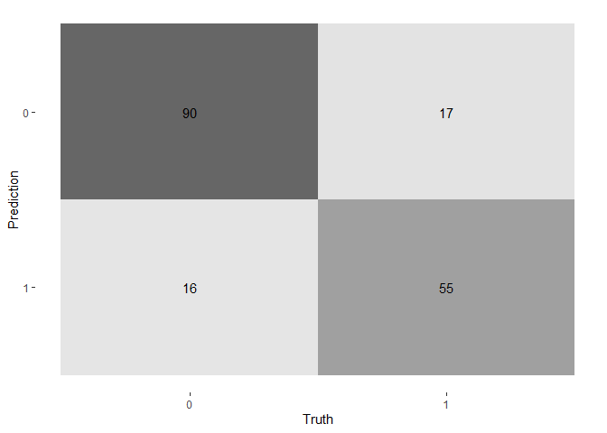

An R Markdown document converted from
“C:/Users/Octopus/Downloads/titanic-dataset-notebook.ipynb”
================

------------------------------------------------------------------------

# Wrangling, Exploring, and Predicting the Titanic Dataset

Hello, I am Elijah Rona and this should be my third successful notebook
(Check the others in my [Github
Repository](https://github.com/elijahrona/Elijah-Rona-ML-Journey)). I am
trying to improve my datascience skills, so [hit me
up](https://twitter.com/elijah_rona) if you can assist… Thanks

I used this model to deploy an R Shiny App through which you can check
if you would have survived the titanic shipwreck or not. [Here’s a link
to the
app](https://elijah-rona.shinyapps.io/Titanic-EDA-and-Prediction/).
Please play with it and give me
[feedback](https://twitter.com/elijah_rona). Thanks a lot.

## Loading the Libraries and Datasets

Libraries

``` r
library(skimr)
library(tidyverse)
```

    ## -- Attaching packages --------------------------------------- tidyverse 1.3.1 --

    ## v ggplot2 3.3.5     v purrr   0.3.4
    ## v tibble  3.1.2     v dplyr   1.0.7
    ## v tidyr   1.1.3     v stringr 1.4.0
    ## v readr   1.4.0     v forcats 0.5.1

    ## -- Conflicts ------------------------------------------ tidyverse_conflicts() --
    ## x dplyr::filter() masks stats::filter()
    ## x dplyr::lag()    masks stats::lag()

``` r
library(tidymodels)
```

    ## Registered S3 method overwritten by 'tune':
    ##   method                   from   
    ##   required_pkgs.model_spec parsnip

    ## -- Attaching packages -------------------------------------- tidymodels 0.1.3 --

    ## v broom        0.7.10     v rsample      0.1.0 
    ## v dials        0.0.10     v tune         0.1.6 
    ## v infer        0.5.4      v workflows    0.2.3 
    ## v modeldata    0.1.1      v workflowsets 0.1.0 
    ## v parsnip      0.1.7      v yardstick    0.0.8 
    ## v recipes      0.1.16

    ## -- Conflicts ----------------------------------------- tidymodels_conflicts() --
    ## x scales::discard() masks purrr::discard()
    ## x dplyr::filter()   masks stats::filter()
    ## x recipes::fixed()  masks stringr::fixed()
    ## x dplyr::lag()      masks stats::lag()
    ## x yardstick::spec() masks readr::spec()
    ## x recipes::step()   masks stats::step()
    ## * Use tidymodels_prefer() to resolve common conflicts.

``` r
library(ggpubr)
```

The train dataset

``` r
train <- read.csv("./train.csv")
```

``` r
head(train)
```

    ##   PassengerId Survived Pclass
    ## 1           1        0      3
    ## 2           2        1      1
    ## 3           3        1      3
    ## 4           4        1      1
    ## 5           5        0      3
    ## 6           6        0      3
    ##                                                  Name    Sex Age SibSp Parch
    ## 1                             Braund, Mr. Owen Harris   male  22     1     0
    ## 2 Cumings, Mrs. John Bradley (Florence Briggs Thayer) female  38     1     0
    ## 3                              Heikkinen, Miss. Laina female  26     0     0
    ## 4        Futrelle, Mrs. Jacques Heath (Lily May Peel) female  35     1     0
    ## 5                            Allen, Mr. William Henry   male  35     0     0
    ## 6                                    Moran, Mr. James   male  NA     0     0
    ##             Ticket    Fare Cabin Embarked
    ## 1        A/5 21171  7.2500              S
    ## 2         PC 17599 71.2833   C85        C
    ## 3 STON/O2. 3101282  7.9250              S
    ## 4           113803 53.1000  C123        S
    ## 5           373450  8.0500              S
    ## 6           330877  8.4583              Q

## Data Wrangling (Cleaning)

Let us explore the train dataset as we look for areas that need editing

``` r
skimmed <- skim_to_wide(train)
```

    ## Warning: 'skim_to_wide' is deprecated.
    ## Use 'skim()' instead.
    ## See help("Deprecated")

``` r
skimmed <- skimmed[, c(1:5, 9:11, 13, 15:16)]
skimmed
```

|                                                  |       |
|:-------------------------------------------------|:------|
| Name                                             | .data |
| Number of rows                                   | 891   |
| Number of columns                                | 12    |
| \_\_\_\_\_\_\_\_\_\_\_\_\_\_\_\_\_\_\_\_\_\_\_   |       |
| Column type frequency:                           |       |
| character                                        | 5     |
| numeric                                          | 7     |
| \_\_\_\_\_\_\_\_\_\_\_\_\_\_\_\_\_\_\_\_\_\_\_\_ |       |
| Group variables                                  | None  |

Data summary

**Variable type: character**

| skim_variable | n_missing | complete_rate | min | whitespace |
|:--------------|----------:|--------------:|----:|-----------:|
| Name          |         0 |             1 |  12 |          0 |
| Sex           |         0 |             1 |   4 |          0 |
| Ticket        |         0 |             1 |   3 |          0 |
| Cabin         |         0 |             1 |   0 |          0 |
| Embarked      |         0 |             1 |   0 |          0 |

**Variable type: numeric**

| skim_variable | n_missing | complete_rate |   mean |     sd |    p25 |   p75 |   p100 |
|:--------------|----------:|--------------:|-------:|-------:|-------:|------:|-------:|
| PassengerId   |         0 |           1.0 | 446.00 | 257.35 | 223.50 | 668.5 | 891.00 |
| Survived      |         0 |           1.0 |   0.38 |   0.49 |   0.00 |   1.0 |   1.00 |
| Pclass        |         0 |           1.0 |   2.31 |   0.84 |   2.00 |   3.0 |   3.00 |
| Age           |       177 |           0.8 |  29.70 |  14.53 |  20.12 |  38.0 |  80.00 |
| SibSp         |         0 |           1.0 |   0.52 |   1.10 |   0.00 |   1.0 |   8.00 |
| Parch         |         0 |           1.0 |   0.38 |   0.81 |   0.00 |   0.0 |   6.00 |
| Fare          |         0 |           1.0 |  32.20 |  49.69 |   7.91 |  31.0 | 512.33 |

If you go back to the dataset, you should notice blank spaces without NA
in the Cabin column. Why is the skimmed data showing a 100% completion
rate for the dataset? Well, because they are not NA. Let us convert
these spaces to NAs

``` r
train <- train %>%
  mutate(Cabin = ifelse(train$Cabin == "", NA, Cabin))
```

We are successfully converted every black space in the Cabin column.
Well, let us check other columns for blank spaces

``` r
which(train=="",arr.ind=TRUE)
```

    ##      row col
    ## [1,]  62  12
    ## [2,] 830  12

There are two black spaces in the dataset. Let us convert them to NAs

``` r
train[62,12] <- NA
train[830,12] <- NA
```

I’d love to explore the Cabin column to see if the people with recorded
Cabins survived or not. This will be strictly EDA and we will not use it
for our model

``` r
train <- train %>%
  mutate(Cabin = ifelse(is.na(train$Cabin) == "TRUE", "Not Recorded", "Recorded"))
```

There are so many ways to deal with missing variables. Well, let us omit
the rows with missing variables

``` r
train <- na.omit(train)
```

Finally, it is going to be a classification model, so let us convert
necessary columns to factors

``` r
train <- train %>%
  mutate(across(c(Survived, Pclass, Sex, Cabin, Embarked), as.factor))
```

Now it is time to wrangle the test dataset. Note that we will not be
using this dataset because my purpose of this notebook is to build a
model that I can evaluate (so I need to compare the predicted outcomes
with actual outcomes). Since the test dataset does not have the actual
outcomes, I will be splitting the train dataset.

``` r
test <- read.csv("./test.csv")

test <- test %>%
  mutate(Cabin = ifelse(test$Cabin == "", NA, Cabin))

test <- test %>%
  mutate(Cabin = ifelse(is.na(test$Cabin) == "TRUE", "Not Recorded", "Recorded"))

test <- test %>%
  mutate(Age = round(ifelse(is.na(Age) == "TRUE", mean(Age, na.rm = TRUE), Age)),0)

test <- test %>%
  mutate(Fare = ifelse(is.na(Fare) == "TRUE", mean(Fare, na.rm = TRUE), Fare))

test <- test %>%
  mutate(across(c(Pclass, Sex, Cabin, Embarked), as.factor))

which(test=="",arr.ind=TRUE)
```

    ##      row col

## Exploratory Data Analysis

Let us explore the Pclass column

``` r
g1 <- ggplot(train, aes(x = Pclass, fill = Survived)) + 
  geom_bar(color = "black") +
  theme(
    panel.background = element_rect(fill = "white",
                                    colour = "white",
                                    size = 0.5, linetype = "solid"))
g1
```

<!-- -->

As you can see from the plot, people who bought te

``` r
#get columns by index (You can call columns with this...)
factor_predicator <- names(train)[3:12]
factor_predicator <- factor_predicator[c(1, 3, 9, 10)]
factor_predicator <- set_names(factor_predicator)
response <- names(train)[2]
response <- set_names(response)

#create loop function
chart_fun <- function(x, y) {
  ggplot(train, aes(fill=.data[[x]], x=.data[[y]])) + 
    geom_bar(colour="black") +
    theme(
      panel.background = element_rect(fill = "white",
                                      colour = "white",
                                      size = 0.5, linetype = "solid")) +
    labs(title = paste(x))
}

#do the do (change $ to the column name). BEST
finally <- map(response, ~map(factor_predicator, chart_fun, y = .x))
```

``` r
finally$Survived$Pclass
```

<!-- -->

I prefer this form of stacked bars as you can easily tell the majority
class that survived or died. Now let us plot all the cartegorical
variables together

``` r
cowplot::plot_grid(plotlist = finally[[1]])
```

<!-- -->

I love analysing my cartegorical variables with chi-square as it helps
to tell which variable has a significant relationship with the outcome
variable

``` r
chi_square_results <- purrr::map(train[,factor_predicator], ~chisq.test(.x, train$Survived))
chi_square_results
```

    ## $Pclass
    ## 
    ##  Pearson's Chi-squared test
    ## 
    ## data:  .x and train$Survived
    ## X-squared = 91.081, df = 2, p-value < 2.2e-16
    ## 
    ## 
    ## $Sex
    ## 
    ##  Pearson's Chi-squared test with Yates' continuity correction
    ## 
    ## data:  .x and train$Survived
    ## X-squared = 202.87, df = 1, p-value < 2.2e-16
    ## 
    ## 
    ## $Cabin
    ## 
    ##  Pearson's Chi-squared test with Yates' continuity correction
    ## 
    ## data:  .x and train$Survived
    ## X-squared = 71.756, df = 1, p-value < 2.2e-16
    ## 
    ## 
    ## $Embarked
    ## 
    ##  Pearson's Chi-squared test
    ## 
    ## data:  .x and train$Survived
    ## X-squared = 27.919, df = 2, p-value = 8.66e-07

The respective P-Values indicate that all variables have relationship
with the Survived column

Now let us plot for the numeric variables

``` r
numeric_predicator <- names(train)[1:12]
numeric_predicator <- numeric_predicator[c(6, 7, 8, 10)]
numeric_predicator <- set_names(numeric_predicator)

chart_fun1 <- function(x, y) {
  ggplot(train, aes(y=.data[[x]], x=.data[[y]])) + 
    geom_boxplot(fill = 'bisque', color = 'black', alpha = 0.3) +
    geom_jitter(aes(color = 'blue'), alpha = 0.2) +
    guides(color = "none") +
    theme_minimal() +
    coord_cartesian(ylim = quantile(.data[[x]], c(0, 0.999))) +
    labs(title = paste(x))
}

finally1 <- map(response, ~map(numeric_predicator, chart_fun1, y = .x))

cowplot::plot_grid(plotlist = finally1[[1]])
```

<!-- -->

Chi-test for cartegorical, Anova for continous

``` r
anova_results <- purrr::map(train[,numeric_predicator], ~summary(aov(.x ~ train$Survived)))
anova_results
```

    ## $Age
    ##                 Df Sum Sq Mean Sq F value Pr(>F)  
    ## train$Survived   1   1015  1015.1   4.859 0.0278 *
    ## Residuals      710 148327   208.9                 
    ## ---
    ## Signif. codes:  0 '***' 0.001 '**' 0.01 '*' 0.05 '.' 0.1 ' ' 1
    ## 
    ## $SibSp
    ##                 Df Sum Sq Mean Sq F value Pr(>F)
    ## train$Survived   1    0.1  0.1484   0.171  0.679
    ## Residuals      710  615.7  0.8672               
    ## 
    ## $Parch
    ##                 Df Sum Sq Mean Sq F value Pr(>F)  
    ## train$Survived   1    4.7   4.708   6.503  0.011 *
    ## Residuals      710  514.1   0.724                 
    ## ---
    ## Signif. codes:  0 '***' 0.001 '**' 0.01 '*' 0.05 '.' 0.1 ' ' 1
    ## 
    ## $Fare
    ##                 Df  Sum Sq Mean Sq F value   Pr(>F)    
    ## train$Survived   1  141092  141092   54.11 5.26e-13 ***
    ## Residuals      710 1851485    2608                     
    ## ---
    ## Signif. codes:  0 '***' 0.001 '**' 0.01 '*' 0.05 '.' 0.1 ' ' 1

## Model Development

### 1. Splitting the Dataset

``` r
set.seed(123)
titanic_split  <- initial_split(train, 
                                strata = Survived,
                                breaks = 4)
titanic_train  <- training(titanic_split)
titanic_test   <- testing(titanic_split)
```

### 2. Creating Our Recipe

``` r
rec <- 
  recipe(Survived ~ ., data = titanic_train) %>% #Specify dataset, response, and predicators
  update_role(PassengerId, new_role = "ID", old_role = "predictor") %>% #We will use the PassengerId variable as ID and not as a predicator
  remove_role(Name, Ticket, Cabin, old_role = "predictor") %>% #We do not need the Name and Ticket variables in our model
  step_normalize(all_numeric_predictors()) %>% #Normalize numeric predicators
  step_dummy(all_nominal_predictors()) #Create dummy variables for factors
```

### 3. Specifying Our Model

``` r
forest_spec <-
  rand_forest(trees = tune(),
             min_n = tune()) %>%
  set_engine("ranger") %>% 
  set_mode("classification")
```

### 4. Adding the Model and Recipe into a Workflow

``` r
first_wf <- 
  workflow() %>% 
  add_recipe(rec) %>% 
  add_model(forest_spec)
```

### 5. Creating Our Tune Grid for Cross Validation

We will be using tune grid because we tuned our model

``` r
tree_grid <- grid_regular( #chooses sensible values to try for each hyperparameter
  trees(), min_n(), levels = 5) #test 5 different values fpr each parameter
```

Time for the folds (for cross validation)

``` r
set.seed(234)
folds <- vfold_cv(titanic_train)
```

Time to check out the performance of our variables models

``` r
tree_res <- first_wf %>% 
  tune_grid(resamples = folds, grid = tree_grid)
```

Let us see the best hyperparameter combination

``` r
tree_res %>%
  show_best("accuracy")
```

    ## # A tibble: 5 x 8
    ##   trees min_n .metric  .estimator  mean     n std_err .config              
    ##   <int> <int> <chr>    <chr>      <dbl> <int>   <dbl> <chr>                
    ## 1  2000    11 accuracy binary     0.815    10 0.0113  Preprocessor1_Model10
    ## 2  1500     2 accuracy binary     0.815    10 0.00852 Preprocessor1_Model04
    ## 3  1500    11 accuracy binary     0.813    10 0.0105  Preprocessor1_Model09
    ## 4  1000    11 accuracy binary     0.811    10 0.0123  Preprocessor1_Model08
    ## 5  2000     2 accuracy binary     0.811    10 0.0110  Preprocessor1_Model05

``` r
best_tree <- tree_res %>%
  select_best("accuracy")
```

Time to add the best hyperparameter combination into our workflow

``` r
final_wf <- 
  first_wf %>% 
  finalize_workflow(best_tree)
```

### 6. Training (Fitting) Our Model with the Best Hyperparameters

``` r
set.seed(234)
first_fit <- 
  final_wf %>% 
  fit(titanic_train)
```

### 7. Predicting with the Split Dataset

``` r
predicted_data <- augment(first_fit, titanic_test)
```

## Model Evaluation

Let us check the Accuracy and Roc_Auc of our model

``` r
predicted_data %>%
  accuracy(Survived, .pred_class)
```

    ## # A tibble: 1 x 3
    ##   .metric  .estimator .estimate
    ##   <chr>    <chr>          <dbl>
    ## 1 accuracy binary         0.815

``` r
predicted_data %>%
  roc_curve(Survived, .pred_0) %>%
  autoplot()
```

<!-- -->

The model did pretty good. Time to plot a confusion matrix as well as
gather other necessary metrics

``` r
conf_mat(predicted_data, truth = Survived, estimate = .pred_class) %>% 
  autoplot(type = "heatmap")
```

<!-- -->

``` r
caret::confusionMatrix(reference = predicted_data$Survived, data = predicted_data$.pred_class, mode='everything', positive="1")
```

    ## Confusion Matrix and Statistics
    ## 
    ##           Reference
    ## Prediction  0  1
    ##          0 90 17
    ##          1 16 55
    ##                                           
    ##                Accuracy : 0.8146          
    ##                  95% CI : (0.7496, 0.8688)
    ##     No Information Rate : 0.5955          
    ##     P-Value [Acc > NIR] : 3.229e-10       
    ##                                           
    ##                   Kappa : 0.6143          
    ##                                           
    ##  Mcnemar's Test P-Value : 1               
    ##                                           
    ##             Sensitivity : 0.7639          
    ##             Specificity : 0.8491          
    ##          Pos Pred Value : 0.7746          
    ##          Neg Pred Value : 0.8411          
    ##               Precision : 0.7746          
    ##                  Recall : 0.7639          
    ##                      F1 : 0.7692          
    ##              Prevalence : 0.4045          
    ##          Detection Rate : 0.3090          
    ##    Detection Prevalence : 0.3989          
    ##       Balanced Accuracy : 0.8065          
    ##                                           
    ##        'Positive' Class : 1               
    ## 

## Conclusion and Thanks

Would you like to play with this model to see if you survived the
titanic or not? [Checkout the app with this
link](https://elijah-rona.shinyapps.io/Titanic-EDA-and-Prediction/).
Please note that it is just for fun, so do not take your result too
seriously.

If you’d love to contact me, check out my [twitter
handle](https://twitter.com/elijah_rona).
