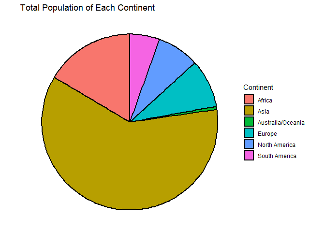
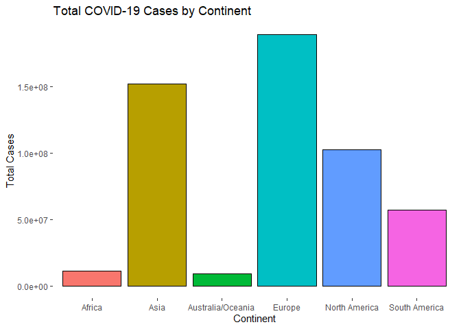
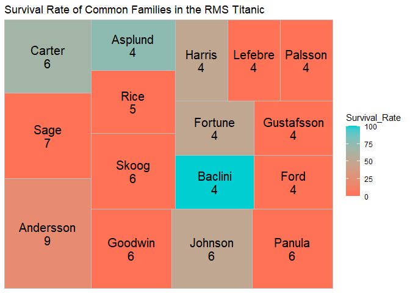
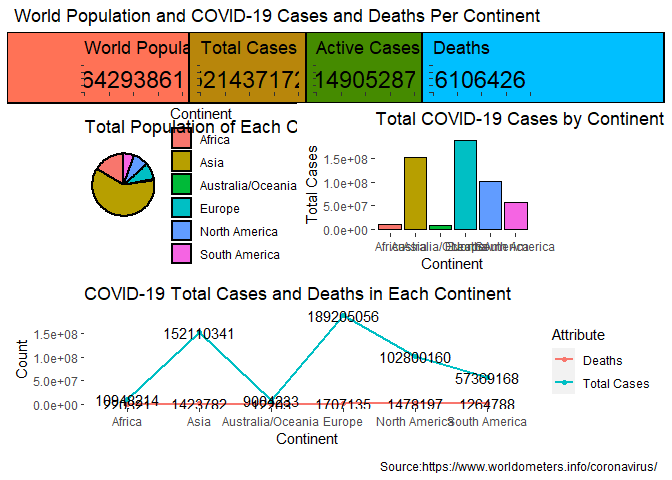

------------------------------------------------------------------------

title: Webscraping, Wrangling, and Simple Analysis output:
rmarkdown::github_document —

# Webscraping, Wrangling, and Simple Analysis

Welcome to this easy notebook. The goal is to collect data from the
internet, clean it, and then do some simple analysis with it.

I am Elijah Rona and you can find me on
[Twitter](https://twitter.com/Elijah_Rona) and
[LinkedIn](https://www.linkedin.com/in/elijah-rona-389646124/). Here’s
my (incomplete) [GitHub ML
repository](https://github.com/elijahrona/Elijah-Rona-ML-Journey).

Let’s start with our analysis.

## Loading the Libraries

``` r
#Loading libraries
library(tidyverse) #dplyr and ggplot2
```

    ## -- Attaching packages --------------------------------------- tidyverse 1.3.1 --

    ## v ggplot2 3.3.5     v purrr   0.3.4
    ## v tibble  3.1.2     v dplyr   1.0.7
    ## v tidyr   1.1.3     v stringr 1.4.0
    ## v readr   1.4.0     v forcats 0.5.1

    ## -- Conflicts ------------------------------------------ tidyverse_conflicts() --
    ## x dplyr::filter() masks stats::filter()
    ## x dplyr::lag()    masks stats::lag()

``` r
library(robotstxt) #to check if we have access to the page
```

    ## Warning: package 'robotstxt' was built under R version 4.1.3

``` r
library(rvest) #collect data from websites
```

    ## 
    ## Attaching package: 'rvest'

    ## The following object is masked from 'package:readr':
    ## 
    ##     guess_encoding

``` r
library(httr) #same as rvest
library(patchwork) #combining plots
```

    ## Warning: package 'patchwork' was built under R version 4.1.3

``` r
library(repr) #Resize plots
```

## Webscraping

First of all, let’s check if we can access the website. We will be
collecting COVID-19 data from
[Worldometers](https://www.worldometers.info/coronavirus/).

``` r
x <- "https://www.worldometers.info/coronavirus/"
paths_allowed(x)
```

    ## www.worldometers.info

    ## Warning in request_handler_handler(request = request, handler = on_not_found, :
    ## Event: on_not_found

    ## Warning in request_handler_handler(request = request, handler =
    ## on_file_type_mismatch, : Event: on_file_type_mismatch

    ## Warning in request_handler_handler(request = request, handler =
    ## on_suspect_content, : Event: on_suspect_content

    ## 

    ## [1] TRUE

Now that we know that we can access the website, time to load it into
our notebook.

``` r
y <- read_html(x)
```

Let’s extract the tables from the website.

``` r
tables <- y %>%
  html_table(fill = TRUE)
```

Since the table we want is th very first table in the page, let’s call
the first table

``` r
first_table <- tables[[1]]
head(first_table)
```

    ## # A tibble: 6 x 22
    ##     `#` `Country,Other` TotalCases NewCases TotalDeaths NewDeaths TotalRecovered
    ##   <int> <chr>           <chr>      <chr>    <chr>       <chr>     <chr>         
    ## 1    NA North America   102,830,0~ +60,651  1,478,490   +277      96,705,279    
    ## 2    NA Asia            157,859,1~ +183,555 1,434,123   +289      150,965,296   
    ## 3    NA South America   58,257,124 +58,019  1,300,437   +121      55,383,637    
    ## 4    NA Europe          198,355,0~ +178,480 1,846,615   +480      188,529,039   
    ## 5    NA Oceania         9,080,556  +40,989  12,865      +82       8,706,346     
    ## 6    NA Africa          12,191,740 +4,260   255,250     +25       11,397,803    
    ## # ... with 15 more variables: NewRecovered <chr>, ActiveCases <chr>,
    ## #   Serious,Critical <chr>, Tot Cases/1M pop <chr>, Deaths/1M pop <chr>,
    ## #   TotalTests <chr>, Tests/1M pop <chr>, Population <chr>, Continent <chr>,
    ## #   1 Caseevery X ppl <chr>, 1 Deathevery X ppl <chr>, 1 Testevery X ppl <int>,
    ## #   New Cases/1M pop <chr>, New Deaths/1M pop <dbl>, Active Cases/1M pop <chr>

As you can see from the table, there are too many columns and we ma not
use them all. Let us collect just the columns that we will need for our
simple analysis. \## Data Wrangling It is time to clean the table and
use just columns that we need.

``` r
first_table <- first_table[-c(1:8),]
first_table <- first_table[,c("Country,Other", "TotalCases", "TotalDeaths",
                              "TotalRecovered", "ActiveCases",
                              "TotalTests", "Population",
                              "Continent")]
head(first_table)
```

    ## # A tibble: 6 x 8
    ##   `Country,Other` TotalCases TotalDeaths TotalRecovered ActiveCases TotalTests  
    ##   <chr>           <chr>      <chr>       <chr>          <chr>       <chr>       
    ## 1 USA             87,070,948 1,035,171   82,888,463     3,147,314   1,037,518,2~
    ## 2 India           43,207,265 524,723     42,640,301     42,241      853,863,238 
    ## 3 Brazil          31,360,850 667,790     30,155,386     537,674     63,776,166  
    ## 4 France          29,753,370 148,710     29,166,810     437,850     271,490,188 
    ## 5 Germany         26,727,874 140,009     25,803,300     784,565     122,332,384 
    ## 6 UK              22,373,146 179,165     22,013,928     180,053     522,526,476 
    ## # ... with 2 more variables: Population <chr>, Continent <chr>

Now that we have the columns that we need, let us convert the columns
from type character to numeric. We will do this by first removing the
commas (“,”) from the entire dataset.

``` r
#Remove "," from the table
first_table <- data.frame(lapply(first_table, function(x) {
  gsub(",", "", x)
  }))

#Convert columns to numeric
first_table <- first_table %>%
  mutate(across(c(TotalCases, TotalDeaths,
                  TotalRecovered, ActiveCases,
                  TotalTests, Population), as.numeric))
```

    ## Warning in mask$eval_all_mutate(quo): NAs introduced by coercion

    ## Warning in mask$eval_all_mutate(quo): NAs introduced by coercion

There are some missing values in the dataset, so let us remove them.
Note that there are other ways to deal with missing values.

``` r
first_table <- na.omit(first_table)
```

Now let us do a simple analysis with the table \## Simple Analysis
(Visualization) First of all, let us get the sum of the population,
total cases, active cases, and deaths in the entire dataset by grouping
the continents.

``` r
continents <- first_table %>%
  group_by(Continent) %>%
  summarize(Deaths = sum(TotalDeaths),
            `Total Cases` = sum(TotalCases),
            `Active Cases` = sum(ActiveCases),
            `Population` = sum(Population))
```

### 1. Population (Pie Chart)

``` r
#Population
g1 <- continents %>%
  ggplot(aes(x="", y=Population, fill=Continent)) +
  geom_bar(stat="identity", width=1, color="black", size=1) +
  coord_polar("y", start=0) +
  ggtitle("Total Population of Each Continent") +
  theme(
    panel.background = element_rect(fill = "white",
                                    colour = "white",
                                    size = 0.5, linetype = "solid")) +
  theme_void()

g1
```

<!-- -->

### 2. Total Cases (Column Chart)

``` r
#Total Cases
g2 <- ggplot(continents, aes(x = Continent, y = `Total Cases`, fill = Continent)) + 
  geom_bar(color = 'black', stat = "identity") +
  ggtitle("Total COVID-19 Cases by Continent") +
  theme(panel.background = element_rect(fill = "white",
                                        colour = "white",
                                        size = 0.5, linetype = "solid")) +
  guides(fill=FALSE)
```

    ## Warning: `guides(<scale> = FALSE)` is deprecated. Please use `guides(<scale> =
    ## "none")` instead.

``` r
g2
```

<!-- -->

### 3. Active Cases and Deaths (Line Chart)

To use multiple attributes in the chart, we need to bind the table just
like a pivot table in Excel.

``` r
#Bind the table
continents1 <- cbind(continents[1], stack(continents[c(2,3)]))

#Rename columns
continents1 <- continents1 %>% 
  rename(Count = values, Attribute = ind)

#Reorder columns
continents1 <- continents1[,c(1,3,2)]

head(continents1)
```

    ##           Continent Attribute   Count
    ## 1            Africa    Deaths  220321
    ## 2              Asia    Deaths 1423782
    ## 3 Australia/Oceania    Deaths   12203
    ## 4            Europe    Deaths 1707135
    ## 5     North America    Deaths 1478197
    ## 6     South America    Deaths 1264788

Time to create the chart.

``` r
g3 <- ggplot(data=continents1, aes(x=Continent, y=Count, group=Attribute,
                                   colour=Attribute, label = Count)) +
  geom_line(size = 1.0) +
  geom_point() +
  geom_text(colour = "black") +
  theme(
    panel.background = element_rect(fill = "white",
                                    colour = "white",
                                    size = 0.5, linetype = "solid")) +
  ggtitle("COVID-19 Total Cases and Deaths in Each Continent")
g3
```

<!-- -->

### Combining the Plots to Make a Dashboard

Let’s first combine ever plot that we have made together.

``` r
g4 <- (g1+g2 + plot_layout(widths = c(1, 2)))/g3
```

Now let us create empty plots that contain just the sum of the different
attributes. They will give more details to the dashboard.

``` r
#Create a blank theme (that permits border and color)
theme <- theme(axis.text.y   = element_blank(),
      axis.text.x   = element_blank(),
      axis.title.y  = element_blank(),
      axis.title.x  = element_blank(),
      panel.background = element_blank(),
      panel.grid.major = element_blank(), 
      panel.grid.minor = element_blank(),
)

#Population
g5 <- ggplot() +
  annotate("text", x = 10,  y = 10,
           size = 6,
           label = sum(continents$Population)) + 
  labs(
    title = "World Population",       # plot title
  ) +
  theme +
  theme(plot.background = element_rect(colour = "black", fill="coral1", size=1))

#Total Cases
g6 <- ggplot() +
  annotate("text", x = 10,  y = 10,
           size = 6,
           label = sum(continents$`Total Cases`)) + 
  labs(
    title = "Total Cases",       # plot title
  ) +
  theme +
  theme(plot.background = element_rect(colour = "black", fill="darkgoldenrod", size=1))

#Active Cases
g7 <- ggplot() +
  annotate("text", x = 10,  y = 10,
           size = 6,
           label = sum(continents$`Active Cases`)) + 
  labs(
    title = "Active Cases",       # plot title
  ) +
  theme +
  theme(plot.background = element_rect(colour = "black", fill="chartreuse4", size=1))

#Deaths
g8 <- ggplot() +
  annotate("text", x = 10,  y = 10,
           size = 6,
           label = sum(continents$Deaths)) + 
  labs(
    title = "Deaths",       # plot title
  ) +
  theme +
  theme(plot.background = element_rect(colour = "black", fill="deepskyblue", size=1))
```

And now, let us see the magic that we have created.

``` r
options(repr.plot.width=16, repr.plot.height = 8)

g9 <- ((g5|g6|g7|g8)/g4) + plot_annotation(
  title = "World Population and COVID-19 Cases and Deaths Per Continent",
  caption = paste0("Source:", x)) + plot_layout(heights = c(0.2, 2))
g9
```

<!-- -->

Wonderful, right? Remember that the details in this dahsboard are not
fully correst as we deleted some rows with missing values (NAs).

## Conclusion

Thank you for joining me in this webscraping and simple analysis
journey. Would you like to see something cool that I did, [check out
this
webapp](https://elijah-rona.shinyapps.io/Titanic-EDA-and-Prediction/)
that checks if you would have survived the Titanic or not (based on
inputs from the Titanic dataset).

Thanks a lot once again, do not forget to contact me on
[Twitter](https://twitter.com/Elijah_Rona)
